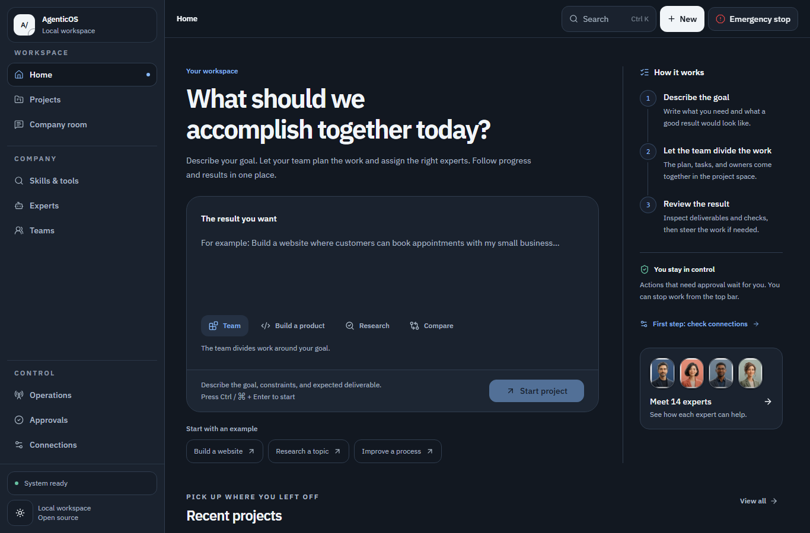
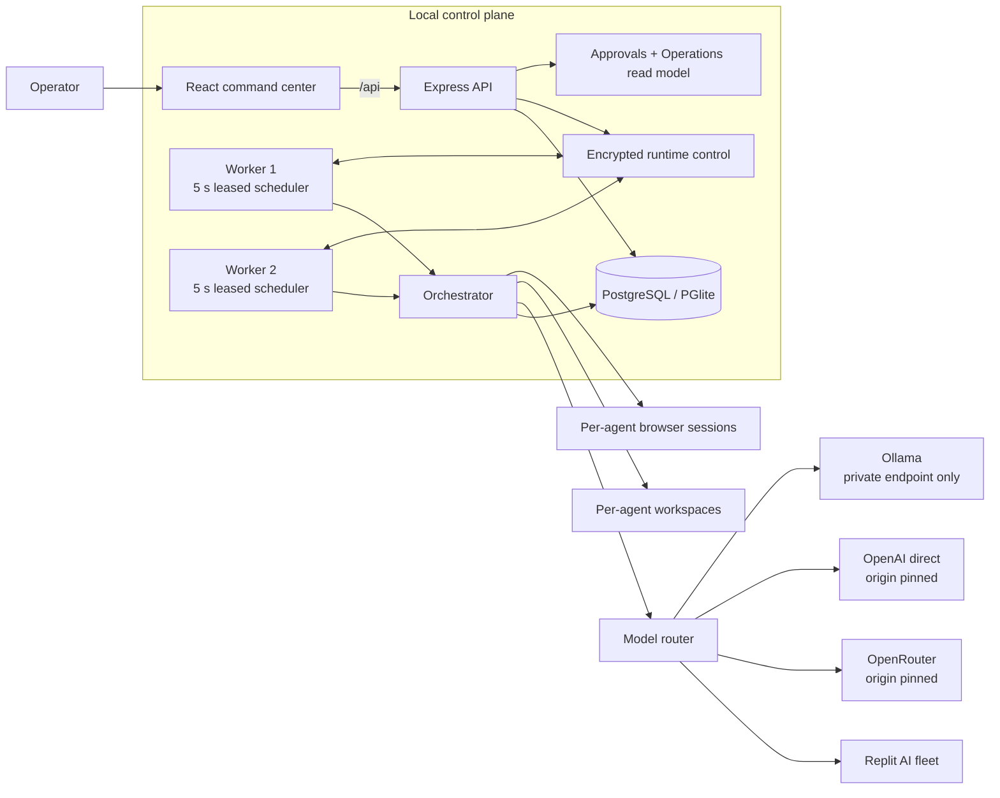

# Agentic Company OS

**A local-first command center for running an AI-staffed organization.**

[Türkçe](./README.tr.md) · [Architecture](./docs/architecture.md) · [Competitive benchmark](./docs/competitive-benchmark.md) · [Security model](./docs/security-model.md) · [Self-hosting](./docs/self-hosting.md) · [Phone access](./docs/mobile-access.md) · [Localization](./docs/localization.md) · [Endurance proof](./docs/endurance.md) · [Release checklist](./docs/release-checklist.md) · [Changelog](./CHANGELOG.md) · [Roadmap](./docs/roadmap.md)

> [!IMPORTANT]
> This project is **alpha software** and is designed for one trusted operator. Production and non-loopback startup fail closed without the built-in operator token and durable PostgreSQL. The token is not multi-user authorization: put remote deployments behind TLS, keep the API port private, and apply the network and backup controls described below.

**Release status:** Alpha under active verification. The [verification record](./docs/verification/2026-09-28-extensible-release.md) separates completed source, browser, secret/history and PostgreSQL checks from remaining acceptance work. Check [GitHub Actions](https://github.com/halittayyar0/Agentic-Company-OS/actions) for the result of the exact revision you install. A passing smoke test does not establish 24-hour reliability or physical-phone/native-language acceptance.

Agentic Company OS turns agent orchestration into an observable operating system: an operator can define goals, talk to any agent, delegate through a hierarchy, inspect every active task, review approval requests, and see which agent is doing what in real time.

It is deliberately more than a chat UI. The repository combines an animated operations console, editable agent identities and prompts, an autonomous task scheduler, per-agent workspaces, browser control, multi-provider model routing, and an activity trail.



## What is here

- **Skills and tools** — 30 first-party work guides across research, software, data, content and operations, plus 24 capability tools and 22 runtime tools. Browse the seven-language library, inspect requirements, and create an editable project draft. Agents can discover and read the same guides. See [skills and tools](./docs/skills-and-tools.md).

- **Live command center** — org chart, active-agent pulse, task metrics, activity stream, sparklines, health state, and keyboard command palette.
- **Project Studio** — every root project keeps its own chat, delegated work, meetings, transcripts, decisions, action items, and delivery evidence in one durable context. Its computer panel shows the coordinator's agent-scoped workspace, which may also serve other projects owned by that agent.
- **Natural Company Room** — add any active agent to a persistent group room with no separate room-member cap; the global active workforce still obeys `MAX_ACTIVE_AGENTS`. `@mentions` call only selected members, while unmentioned messages use role relevance and a no-reply gate instead of forcing everyone to answer.
- **Agent organization** — a stock roster of one CEO, nine department directors, and four specialists in design, quality, data, and automation, plus a reusable specialist template. Managers can create specialists and delegate work recursively.
- **Workforce Studio** — three versioned, installable crew blueprints turn an active manager into a real hierarchy with bounded permissions, explicit handoff contracts, and an optional finite or continuous root outcome in one transaction.
- **Editable identities** — names, role prompts, permissions, model pins, and locally processed avatars can be changed per agent. Avatar bytes stay out of roster payloads and use a bounded, versioned image endpoint.
- **Direct agent chat** — the operator can talk to any agent, not only the CEO, with per-message or persistent model selection.
- **Observable execution** — the Run Inspector reconstructs a six-stage work spine from persisted task and activity evidence, exposing routing, tools, approvals, judge results, model fallback, and recovery without leaking raw commands, form input, or chain-of-thought.
- **Operations Room** — project work, queue depth, team presence, attempts, logical executions, invocations, receipts and unknown-outcome reconciliation use durable records. Fleet health samples are labeled separately from project evidence. Missing or stale evidence remains visible; full sample coverage is not a 24-hour endurance certificate.
- **Persistent autonomous task loop** — finite work keeps running to a judged result or a typed real blocker; continuous responsibilities wake on durable cadence. A dedicated operator handoff resumes only tasks waiting for user input, while database task/agent leases prevent double claims and recover expired work.
- **Per-agent computer** — sandbox-rooted file tools, restricted built-in commands, optional allowlisted process execution, and separate in-memory Playwright browser contexts.
- **Human oversight with runtime gates** — exact, expiring, single-use approvals are enforced for agent browser typing, unsafe clicks, and destructive VM commands; broader business-action policy remains visible and reviewable.
- **Resilient multi-provider models** — autonomous task and judge execution can route across the built-in Replit AI fleet, the complete live OpenRouter catalog, direct OpenAI, and tool-capable local Ollama models with bounded retry/fallback. Provider IDs are namespaced where necessary, task-owned manual pins persist, and explicit free/local selections never drift to paid routes.
- **Motion with purpose** — status pulses, transitions, gauges, live tickers, and charts make changes in the organization visible rather than decorative.
- **Language at first run** — choose Turkish, English, German, Russian, Simplified Chinese, Traditional Chinese, or Arabic before sign-in and change it later in Settings. The selected language persists for the workspace and guides future agent replies. Setup, login, navigation, shared status, Home, project listing/creation, expert listing/creation, Team Studio, Approvals, Company Room, Connections/Settings, expert and project workspaces, meetings, file/terminal/browser tools, Operations and the shared emergency stop have translated controls and recovery messages. Route language packs load on demand. The 15 managed role playbooks, three team blueprints, 30 skill guides and new application-authored output from the built-in tools have seven-language catalogs. Exact commands, custom instructions, external output and historical records retain their original content. Native-speaker acceptance remains outstanding. See [localization coverage](./docs/localization.md) before treating a language as complete.
- **Phone browser access** — responsive pages work on a phone without a separate app. The [private access guide](./docs/mobile-access.md) uses the existing protected web server and a private HTTPS tunnel or self-managed VPN.
- **Recorded questions and answer recovery** — review the exact question, keep a draft through reloads, and recover uncertain sends from a durable receipt. A delayed answer cannot resume a different question. See [answer recovery and the alpha API upgrade](./docs/task-answer-recovery.md).

- **Source-labeled activity and delegation records** — inspect bounded records in seven languages, preserve loaded data on refresh failure, and distinguish tool intent from execution evidence. See [activity records and export boundaries](./docs/activity-records.md).

## Architecture at a glance



The UI is a Vite/React application. Production Compose starts one HTTP-only API through `start.mjs` and two scheduler-only processes through `start-worker.mjs`; all three share PostgreSQL. The API owns operator authentication, durable read models, approvals, and an authenticated encrypted runtime-control channel. Workers own leased orchestration turns and process-local tools. `combined` remains a single-process development compatibility mode. Task, agent, attempt, invocation, and runtime-instance leases fence stale processes. Durable operation receipts provide replay, idempotent, at-most-once safe-drop, and explicit unknown-outcome reconciliation semantics, but the project does not claim universal end-to-end exactly-once external effects. Playwright sessions and element-reference registries remain process-local and commands are routed to their exact runtime owner. See [docs/architecture.md](./docs/architecture.md) for the execution and prompt layers.

## Security posture

The defaults are intentionally local-first:

| Control                          | Default                            | What it means                                                                                                                                   |
| -------------------------------- | ---------------------------------- | ----------------------------------------------------------------------------------------------------------------------------------------------- |
| API and Vite bind addresses      | `127.0.0.1`                        | API, dev UI, and preview stay on the host unless the operator explicitly changes their host variables.                                          |
| Remote API access                | Refused                            | A non-loopback API requires production mode, operator auth, PostgreSQL, `ALLOW_REMOTE_ACCESS=true`, exact CORS origins, and trusted hostnames.  |
| Host/cross-site checks           | Enforced                           | Unknown `Host` values get `421`; cross-site state-changing browser requests get `403`. These checks supplement authentication.                  |
| Agent external process execution | Off                                | `ALLOW_AGENT_PROCESS_EXEC=true` is required before allowlisted binaries can be spawned. Sandbox-local built-in file commands remain available.  |
| CEO host shell (`sudo`)          | Off                                | Local-only. Requires the server-managed root CEO, `canUseSudo`, `ALLOW_AGENT_SUDO=true`, and a five-minute exact-command approval.              |
| Founder shell                    | Off                                | `ALLOW_FOUNDER_SHELL=true` enables a full host shell with inherited environment and should be treated as root-equivalent application authority. |
| Browser private-network access   | Off                                | Top-level and subresource requests block local/private/special targets unless the dangerous escape hatch is enabled.                            |
| Browser WebSockets               | Off                                | `AGENT_BROWSER_ALLOW_WEBSOCKETS=true` opts in, while the public-target URL policy still applies.                                                |
| OpenRouter origin                | Pinned                             | Provider credentials can only be sent to `https://openrouter.ai/api/v1`; the base URL is not browser-configurable.                              |
| Direct OpenAI origin             | Pinned                             | The server sends `OPENAI_API_KEY` only to `https://api.openai.com/v1`; request IDs are logged without prompts, responses, or credentials.       |
| Ollama target                    | Private-only                       | The browser cannot set it. Server configuration accepts only localhost, `host.docker.internal`, RFC1918, loopback, or IPv6 ULA targets.         |
| CORS                             | Same-origin, two local dev origins | Additional exact origins require `CORS_ALLOWED_ORIGINS`. CORS is defense in depth, not an identity boundary.                                    |
| Authentication                   | Single operator                    | Bearer login issues a signed HttpOnly, SameSite=Strict cookie; production requires a 32+ character token. No users, roles, MFA, or tenant ACLs. |

Runtime approval checks bind protected tools to one tool/argument hash, task, agent, expiry, and single consumption. Browser typing, non-plain-link clicks, and built-in `rm`/`del` approvals expire after 30 minutes; CEO host-shell approvals expire after five minutes and additionally require a typed hash confirmation. The sudo path rechecks the live server-managed root-CEO identity, permission, local-only runtime gate, command validation, and originating API-process/host/physical-workspace binding before consuming the approval. A restart or replica mismatch safe-drops the action. This approves the exact shell string—not the immutable transitive effect of a referenced script, package command, or remote resource. The shell runs with the existing API service account's OS authority and a minimal environment; it does not perform Windows UAC or Unix privilege elevation. Child/background processes can outlive the observed shell timeout. Browser typing can never submit a form implicitly: entering text and clicking the exact submit control are two separately reviewed steps, with a fresh snapshot between them. Completion judging fails closed when the judge is unavailable or malformed; approval judging degrades to a visible warning while the independent human gate remains mandatory. Per-agent workspaces and CEO host shell are not hardened VM/container boundaries. Read [SECURITY.md](./SECURITY.md) and [docs/security-model.md](./docs/security-model.md) before enabling powerful capabilities.

Playwright sessions and snapshot-ref registries stay in the worker process that created them. The API records that exact runtime/session/epoch owner and sends browser commands only through the authenticated, encrypted runtime-control channel for that owner; browser-client sticky routing is not the ownership mechanism. Immediately before a protected action, the worker rechecks the captured page/element binding. A dead or restarted owner, stale snapshot, changed target, missing acknowledgement, or ambiguous post-dispatch outcome is never silently retargeted or automatically replayed. Depending on where execution stopped, the operation is safely dropped or durably marked `unknown` for explicit operator reconciliation and, when needed, a fresh snapshot and approval.

## Quick start

**Guided installation:** after installing the prerequisites below, run `pnpm install --frozen-lockfile` and `pnpm run setup`. The browser wizard selects this computer or a container, seven languages, a model provider, execution permissions, tool packs and optional private phone access. See [setup and restart instructions](./docs/self-hosting.md#guided-installation-windows-linux-and-macos).

### Prerequisites

- Node.js 24
- Corepack
- The exact pnpm version declared in the root `package.json` `packageManager` field
- Chrome, Edge, or a compatible Chromium installation for browser tools
- PostgreSQL for production, remote access, durability, or multiple replicas; local development can use the embedded, in-memory PGlite fallback

### 1. Install

From a fresh clone:

```bash
corepack enable
pnpm --version
pnpm install --frozen-lockfile
```

Do not install with npm or Yarn. The lockfile and workspace are pnpm-specific.

### 2. Start the API

The API defaults to port `5000`. An LLM provider is optional for boot but required for agent turns.

POSIX shell:

```bash
PORT=5000 \
HOST=127.0.0.1 \
OPENROUTER_API_KEY=your_key_here \
pnpm --filter @workspace/api-server run dev
```

PowerShell:

```powershell
$env:PORT = "5000"
$env:HOST = "127.0.0.1"
$env:OPENROUTER_API_KEY = "your_key_here"
pnpm --filter @workspace/api-server run dev
```

Omit `OPENROUTER_API_KEY` if another provider is configured. Direct OpenAI uses `OPENAI_API_KEY`; local Ollama uses a server-side `OLLAMA_BASE_URL` such as `http://127.0.0.1:11434/v1`. In split API/worker deployments, Settings stores OpenRouter or direct OpenAI keys as an authenticated encrypted PostgreSQL envelope protected by `RUNTIME_CONTROL_KEY`. Combined development retains the gitignored plaintext `data/runtime-config.json` compatibility file; use that convenience only on a trusted single-operator machine.

### 3. Start the UI

Open another terminal.

POSIX shell:

```bash
PORT=5173 \
LOCAL_API_TARGET=http://127.0.0.1:5000 \
pnpm --filter @workspace/agentic-company-os run dev
```

PowerShell:

```powershell
$env:PORT = "5173"
$env:LOCAL_API_TARGET = "http://127.0.0.1:5000"
pnpm --filter @workspace/agentic-company-os run dev
```

Open <http://127.0.0.1:5173>. Verify the backend separately at <http://127.0.0.1:5000/api/healthz>.

> Copy `.env.example` to a gitignored root `.env` for trusted local API configuration. The packaged API start command loads it when present, while variables already exported by the shell or process manager take precedence. Vite/UI variables should still be supplied to the UI process. Prefer a secret manager in production and never commit `.env`.

The Vite development server and preview bind to `127.0.0.1` by default. Keep `DEV_HOST` and `PREVIEW_HOST` on loopback; Vite is not a public deployment server.

## Configuration

The table below highlights the most frequently adjusted controls. [`.env.example`](./.env.example) is the checked-in deployment reference and should be reviewed on every upgrade; startup validation in source remains the final authority.

| Variable                                   | Required                    | Default                   | Purpose                                                                                                                 |
| ------------------------------------------ | --------------------------- | ------------------------- | ----------------------------------------------------------------------------------------------------------------------- |
| `PORT`                                     | No                          | API `5000`; UI `5173`     | Listening port. Use separate values for the API and UI processes.                                                       |
| `NODE_ENV`                                 | No                          | development               | `production` enables fail-closed production validation, secure cookies, HSTS, and structured logs.                      |
| `HOST`                                     | No                          | `127.0.0.1`               | API bind address.                                                                                                       |
| `OPERATOR_AUTH_TOKEN`                      | Production/remote           | unset                     | 32-4096 character single-operator secret. Prefer `OPERATOR_AUTH_TOKEN_FILE` in production.                              |
| `OPERATOR_SESSION_TTL_MS`                  | No                          | `43200000`                | Signed session lifetime; bounded to five minutes through seven days.                                                    |
| `ALLOW_REMOTE_ACCESS`                      | Non-loopback API            | `false`                   | Must be exactly `true` before the API accepts a non-loopback bind.                                                      |
| `TRUSTED_HOSTS`                            | Non-loopback API            | loopback hostnames        | Comma-separated hostnames accepted from the HTTP `Host` header.                                                         |
| `CORS_ALLOWED_ORIGINS`                     | Non-loopback API            | unset                     | Comma-separated exact browser origins; required with remote access.                                                     |
| `RUNTIME_ROLE`                             | No                          | `combined`                | `api` forces scheduling off, `worker` forces it on, and `combined` consults `SCHEDULER_ENABLED`.                        |
| `SCHEDULER_ENABLED`                        | Combined role only          | loopback: on; remote: off | Selects leased scheduling only when `RUNTIME_ROLE=combined`.                                                            |
| `RUNTIME_CONTROL_KEY`                      | Every PostgreSQL deployment | unset                     | Distinct 32–4096 character key for request binding, encrypted Terminal output and internal control; protect its backup. |
| `RUNTIME_CONTROL_API_URL`                  | Worker role                 | unset                     | Exact private-HTTP/HTTPS API control endpoint; workers poll outbound and expose no listener.                            |
| `MAX_TASK_STEPS`                           | No                          | `0`                       | Optional lifetime step cap; `0` keeps finite work alive until an outcome or another circuit breaker.                    |
| `MAX_TASK_TOKENS`                          | No                          | `100000`                  | Finite-task token breaker; continuous lifetime usage remains ledgered.                                                  |
| `MAX_TASK_REPORTED_COST_USD`               | No                          | `1`                       | Finite-task reported-cost breaker; recurring work needs provider/account budgets.                                       |
| `MAX_CONSECUTIVE_TASK_FAILURES`            | No                          | `5`                       | Blocks finite runtime bugs; provider/model exhaustion remains durably queued.                                           |
| `LLM_REQUEST_TIMEOUT_MS`                   | No                          | `120000`                  | Hard provider-call deadline, clamped between 5 seconds and 10 minutes.                                                  |
| `MODEL_FALLBACK_MAX_ROUTES`                | No                          | `3`                       | Cost-compatible model routes per logical task step; clamped to 1-4.                                                     |
| `MODEL_RETRY_ATTEMPTS_PER_ROUTE`           | No                          | `2`                       | Same-route attempts for transient inference failures; clamped to 1-3.                                                   |
| `MODEL_RETRY_BASE_DELAY_MS`                | No                          | `750`                     | Exponential in-step retry base; each delay is capped at 5000 ms.                                                        |
| `MAX_AGENT_TOOL_CALLS_PER_ROUND`           | No                          | `8`                       | Rejects an oversized model tool-call batch before any call executes; clamped to 1-32.                                   |
| `MAX_ACTIVE_AGENTS`                        | No                          | `64`                      | Global active-agent capacity enforced under the runtime control lock.                                                   |
| `MAX_OUTSTANDING_TASKS`                    | No                          | `500`                     | Global active task capacity across queued and running states.                                                           |
| `MAX_OUTSTANDING_APPROVALS`                | No                          | `200`                     | Global pending-approval capacity.                                                                                       |
| `MAX_MESSAGES_PER_AGENT`                   | No                          | `5000`                    | Durable per-agent message retention circuit breaker.                                                                    |
| `MAX_COMPANY_MESSAGES`                     | No                          | `50000`                   | Global durable Company Room message circuit breaker; positive values are capped at 1000000.                             |
| `COMPANY_CHAT_MAX_RESPONSE_ATTEMPTS`       | No                          | `6`                       | Maximum need-to-reply model gates per founder message; the room adds no cap beyond `MAX_ACTIVE_AGENTS`.                 |
| `COMPANY_CHAT_RESPONSE_CONCURRENCY`        | No                          | `1`                       | Bounded room responder pool; sequential by default so later responders see earlier replies.                             |
| `COMPANY_CHAT_RESPONSE_MAX_TOKENS`         | No                          | `400`                     | Maximum completion tokens for one Company Room response.                                                                |
| `COMPANY_CHAT_RESPONSE_TOKEN_BUDGET`       | No                          | `2400`                    | Aggregate completion-token reservation for one Company Room dispatch.                                                   |
| `PROJECT_MEETING_MAX_RESPONDERS_PER_START` | No                          | `8`                       | Maximum tool-free turns per meeting start; the roster adds no cap beyond the global active-agent capacity.              |
| `PROJECT_MEETING_MAX_CONCURRENT_STARTS`    | No                          | `2`                       | Shared-database live meeting reservations across API replicas; clamped to 1-16.                                         |
| `DEV_HOST` / `PREVIEW_HOST`                | No                          | `127.0.0.1`               | Vite dev/preview bind addresses. Keep loopback.                                                                         |
| `DEV_ALLOWED_HOSTS`                        | No                          | Vite safe defaults        | Comma-separated hostnames accepted by the Vite dev/preview server.                                                      |
| `LOCAL_API_TARGET`                         | Local UI only               | `http://127.0.0.1:5000`   | Proxies UI `/api` calls to the local API during non-Replit Vite development.                                            |
| `OPENROUTER_API_KEY`                       | Provider-dependent          | unset                     | Enables OpenRouter. Never commit it.                                                                                    |
| `APP_PUBLIC_URL`                           | No                          | unset                     | Optional validated origin sent as OpenRouter `HTTP-Referer` attribution; never changes the API origin.                  |
| `OPENAI_API_KEY`                           | Provider-dependent          | unset                     | Enables direct OpenAI at the code-pinned first-party API origin. Never commit it.                                       |
| `OPENAI_MODEL_IDS`                         | No                          | unset                     | Server-admin comma-separated direct OpenAI model allowlist additions.                                                   |
| `OLLAMA_BASE_URL`                          | Provider-dependent          | unset                     | Enables local Ollama only for a validated localhost/private endpoint.                                                   |
| `AI_INTEGRATIONS_OPENAI_API_KEY`           | Provider-dependent          | unset                     | Replit AI integration credential.                                                                                       |
| `AI_INTEGRATIONS_OPENAI_BASE_URL`          | Provider-dependent          | unset                     | Replit AI integration endpoint.                                                                                         |
| `DATABASE_URL`                             | Production/remote           | in-memory PGlite in dev   | PostgreSQL connection string; startup applies the versioned migration chain under an advisory lock.                     |
| `ALLOW_AGENT_PROCESS_EXEC`                 | No                          | `false`                   | Enables allowlisted external binaries inside agent workspace roots.                                                     |
| `ALLOW_AGENT_SUDO`                         | No                          | `false`                   | Enables the local-only CEO host-shell path; root identity, permission, and exact approval also apply.                   |
| `ALLOW_FOUNDER_SHELL`                      | No                          | `false`                   | Enables unrestricted host-shell execution from the founder terminal.                                                    |
| `AGENT_SANDBOX_ROOT`                       | No                          | `./agent-sandboxes`       | Overrides the base directory for agent workspaces; omit rather than exporting an empty value.                           |
| `AGENT_BROWSER_CHANNEL`                    | No                          | auto-detect               | `chrome`, `msedge`, or `chromium`.                                                                                      |
| `AGENT_BROWSER_HEADLESS`                   | No                          | headless                  | Set exactly `false` to display browser windows.                                                                         |
| `AGENT_BROWSER_ALLOW_PRIVATE_NETWORKS`     | No                          | `false`                   | Dangerous opt-in allowing browser access to local/private network targets.                                              |
| `AGENT_BROWSER_ALLOW_WEBSOCKETS`           | No                          | `false`                   | Enables `ws:`/`wss:` only after the same public-target check.                                                           |
| `MAX_BROWSER_SESSIONS`                     | No                          | `4`                       | Per-runtime-process cap for live agent browser sessions.                                                                |
| `BROWSER_SESSION_IDLE_MS`                  | No                          | `900000`                  | Closes sessions after this idle period; minimum 60000 ms.                                                               |
| `EMERGENCY_STOP_MONITOR_MS`                | No                          | `20000`                   | Replica-local poll interval for applying the persisted emergency stop even without a scheduler.                         |
| `API_RATE_LIMIT_MAX`                       | No                          | `300`                     | Per-process API requests per fixed window; use a distributed edge limit for replicas.                                   |
| `AUTH_RATE_LIMIT_MAX`                      | No                          | `10`                      | Per-process login attempts per auth window.                                                                             |
| `LOG_LEVEL`                                | No                          | `info`                    | Pino log level.                                                                                                         |
| `BASE_PATH`                                | No                          | `/`                       | Base path for the Vite frontend build.                                                                                  |

See [docs/self-hosting.md](./docs/self-hosting.md) for durable storage and private deployment guidance.

For each chat, task-step, and judge completion, the normal accounting path writes a `usage_events` row with provider/model attribution and normalized prompt, completion, and total token fields. Provider-reported fields are preserved without local estimation. OpenRouter's provider-reported cost is stored directly; other provider costs remain `null` instead of being inferred from a price table. A ledger-write failure is logged and does not roll back the model call. Task circuit breakers are local safety limits evaluated between scheduler steps, not provider billing guarantees—keep provider-side budgets and alerts enabled.

## Agent prompts and permissions

Default identities live in `artifacts/api-server/src/lib/agent-templates.ts`. At runtime, the stored agent prompt is composed with:

1. the agent's identity and department,
2. the editable role prompt,
3. current manager/report relationships,
4. recent task context and activity,
5. available workspace/browser instructions, and
6. organization-wide safety and communication rules.

Prompt changes are product behavior changes. Review them with the same care as code, especially anything involving external contact, deletion, publishing, spending, credentials, or tool use.

Permission flags gate sub-agent creation, delegation, terminal tools, browser tools, and CEO host shell. Spend, delete, publish, and external-contact approval requests are also rejected unless the corresponding live permission is enabled. `canUseSudo` is not authority by itself: the server-managed canonical root-CEO marker, structural identity, `ALLOW_AGENT_SUDO=true`, loopback-only runtime, origin process/host/physical-workspace, five-minute exact-command scope, typed hash confirmation, and single-use consumption must all agree. Runtime checks also require exact scoped approval for browser typing, unsafe clicks, and destructive VM commands. These checks cover implemented action paths, not every possible side effect. Never treat an agent prompt or permission JSON as the security boundary.

## Repository map

```text
artifacts/agentic-company-os/   React/Vite operator console
artifacts/api-server/           HTTP API plus independent worker, orchestration, VM/browser runtime
lib/ai-server/                  Model catalog, provider clients, routing
lib/api-spec/                   OpenAPI source of truth
lib/api-client-react/           Generated React API client
lib/api-zod/                    Generated request/response schemas
lib/db/                         Drizzle schema and database bootstrap
scripts/                        Workspace utilities
docs/                           Architecture, security, hosting, roadmap
```

## Development gates

Root tests run at most two test-file processes concurrently because each database integration file may start its own PGlite runtime. Set `TEST_CONCURRENCY` to an integer from 1 through 8 only when adjusting for the available memory; the default is 2. This controls verification processes, not application workers.

```bash
pnpm run verify
```

The local release gate runs formatting, production dependency/license audits, every automatically discovered test, a clean PGlite migration, typecheck, build, and bundle budget enforcement. GitHub Actions additionally verifies deterministic OpenAPI generation, applies migrations to real PostgreSQL, downloads and SHA-256 verifies a pinned PostgreSQL 17 Windows toolchain for the real native smoke/verifier path, and builds the production container. Container CI starts one API plus two independent workers and proves a killed worker becomes stale before a replacement rejoins; the endurance path reuses one prebuilt image with `--no-build` and verifies the running image IDs plus OCI source labels. The security regression suite covers authentication/rate limits, Host/cross-site guards, browser SSRF policy, sandbox traversal/symlink handling, emergency stop, agent process execution, and founder-shell defaults. CodeQL and secret scanning run in separate least-privilege workflows; contributions should add focused automated and manual verification for changed behavior.

The repository also includes deterministic accelerated evidence plus Docker and native-Windows PostgreSQL wall-clock drivers. A short smoke report is useful but intentionally remains `verified24h: false`; only a real elapsed run of at least 24 hours whose independent verifier accepts every responsibility, receipt, stale-owner, recovery, incident, health, SSE, browser manifest/checkpoint byte, journal, SHA, topology, runtime-provenance, and commit gate is 24-hour evidence. See [Endurance verification](./docs/endurance.md) for exact commands and evidence paths.

If the OpenAPI contract changes, regenerate its clients and schemas:

```bash
pnpm --filter @workspace/api-spec run codegen
pnpm run typecheck
```

## Project status

Agentic Company OS is an experimental, local-first alpha with a supported single-operator private-server baseline: fail-closed auth, versioned migrations, split API/worker processes, durable operation receipts, probes, bounded requests, and container artifacts are included. Near-term priorities are multi-user authorization, hardened disposable tool sandboxes, stronger universal side-effect policy, distributed quotas, recurring recovery drills, and broader end-to-end coverage. Product work is tracked in the [roadmap](./docs/roadmap.md); exact residual risks are tracked in the [security model](./docs/security-model.md).

## Contributing

Contributions are welcome. Start with [CONTRIBUTING.md](./CONTRIBUTING.md), follow the [Code of Conduct](./CODE_OF_CONDUCT.md), and report vulnerabilities through the private process in [SECURITY.md](./SECURITY.md).

## License

Licensed under the [MIT License](./LICENSE).

Bundled IBM Plex font files remain under the SIL Open Font License 1.1; the distributable notice is in [THIRD_PARTY_NOTICES.txt](./artifacts/agentic-company-os/public/THIRD_PARTY_NOTICES.txt).

### Let an agent improve a repository

Settings includes a [reviewed source-change workflow](docs/source-workspaces.md): isolated Git copies, real agent projects, recorded checks, exact-version application and rollback commits. Applying source and deploying a running service are separate steps.

### Add your own executable tools

The Skills editor accepts [user-authored Node tool packages](docs/personal-programs.md), alongside guides and built-in utility presets. Execution follows terminal permission, exact approval, emergency-stop and durable-receipt rules.
