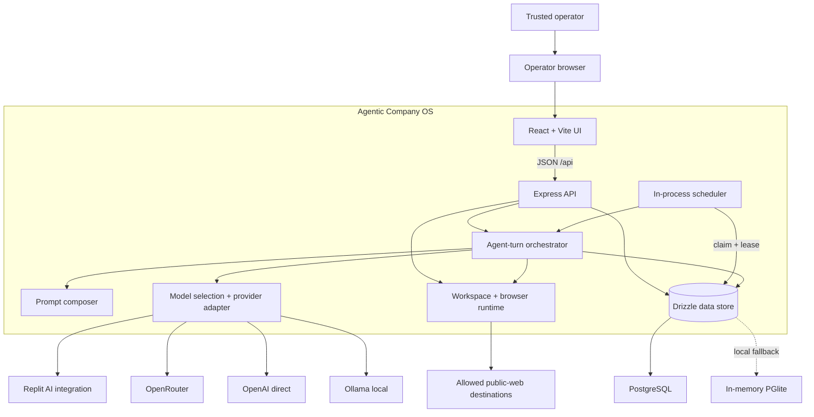
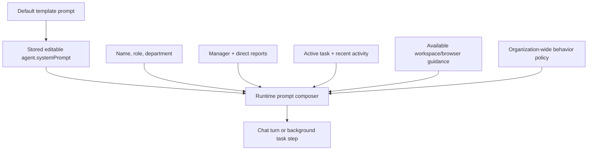
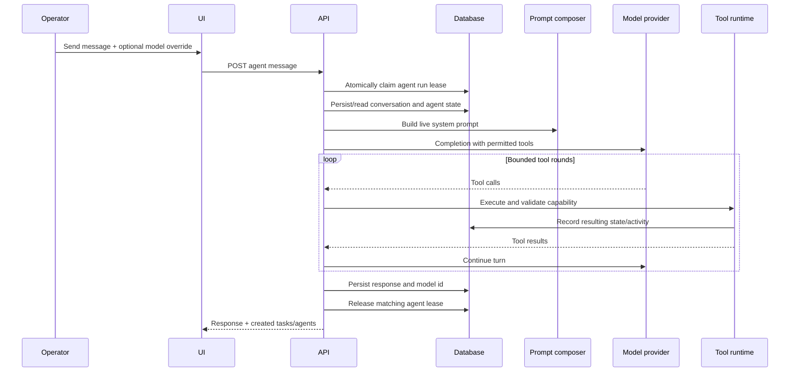

# Architecture

This document describes the current repository architecture, not a future-state design. Agentic Company OS is an alpha, local-first control plane built as a pnpm/TypeScript monorepo.

## Design goals

1. Make an AI organization legible: ownership, hierarchy, work, progress, approvals, and failures should be visible.
2. Let the operator talk to any agent while preserving the organization graph.
3. Keep default local execution easy: no external database is required for a first run.
4. Support multiple model providers without leaking provider-specific behavior through the product.
5. Put dangerous host capabilities behind explicit operator opt-ins.
6. Preserve an activity trail that can explain how a task moved through the organization.

Non-goals in the current alpha include multi-user or multi-tenant authorization, a directly exposed public-internet service, hardened code execution, end-to-end exactly-once external side-effect delivery, and enterprise audit guarantees. The implemented token is deliberately one full-authority operator identity, not an identity platform.

## System context

## Monorepo layout

| Path                           | Responsibility                                                                                                                   |
| ------------------------------ | -------------------------------------------------------------------------------------------------------------------------------- |
| `artifacts/agentic-company-os` | React 19/Vite command-center UI, routing, queries, motion system, and operator controls.                                         |
| `artifacts/api-server`         | Express routes, orchestration, scheduler, prompt composition, runtime configuration, per-agent workspaces, and browser sessions. |
| `lib/ai-server`                | Provider clients, model catalog, provider resolution, automatic tier selection, and unified chat completions.                    |
| `lib/db`                       | Drizzle schemas, PostgreSQL connection, local PGlite bootstrap, and generated initialization SQL.                                |
| `lib/api-spec`                 | OpenAPI source of truth and Orval configuration.                                                                                 |
| `lib/api-client-react`         | Generated browser client and React Query hooks.                                                                                  |
| `lib/api-zod`                  | Generated runtime schemas and domain types.                                                                                      |
| `scripts`                      | Repository utilities.                                                                                                            |

## Control plane

### Operator UI

The UI is a single-page React application. It surfaces:

- organization topology and agent state;
- a project-first studio where one root project owns its chat, delegated work,
  meetings, transcripts, decisions, action items, and delivery evidence;
- the coordinator's agent-scoped workspace files and terminal inside that
  studio; projects with the same coordinator share this workspace today;
- a separate Company Room with durable membership, no room-specific cap beyond
  the global active-agent capacity, explicit
  `@mention` routing, and relevance-gated ambient replies;
- a versioned Workforce Studio for atomic hierarchy and root-outcome installation;
- per-agent chat, model selection, prompt/permission configuration, and statistics;
- tasks, subtasks, progress, cancellation, and a sanitized six-stage Run Inspector;
- pending/resolved approvals;
- agent workspace files and terminal output;
- live agent browser screenshots and operator input;
- provider/runtime settings; and
- system health, command palette, charts, and motion-driven status cues.

The Vite dev/preview servers bind to `127.0.0.1` by default. In non-Replit local development, `/api` proxies to `http://127.0.0.1:5000` unless `LOCAL_API_TARGET` overrides it. Production builds are static files in `artifacts/agentic-company-os/dist/public`; the API can serve that directory on the same origin when `SERVE_STATIC_UI=true` and an absolute `STATIC_UI_DIR` are configured. The production container uses this mode.

### API

The Express API is mounted at `/api`. It validates domain inputs through generated Zod schemas plus route invariants, accepts JSON bodies up to 1 MiB, applies bounded query pagination and per-process request limits, disables `x-powered-by`, adds CSP and baseline response headers, applies an origin-aware credentialed CORS policy, rejects untrusted `Host` headers with `421`, and rejects cross-site state-changing browser requests with `403`. Liveness/readiness and auth bootstrap routes are the only public API surface; protected routes emit `Cache-Control: no-store`.

The API has fail-closed single-operator authentication. A constant-time checked bearer token can create a signed HttpOnly, SameSite=Strict session cookie; production cookies are `Secure`. Production or non-loopback startup requires a 32+ character token and PostgreSQL. Non-loopback additionally requires `NODE_ENV=production`, `ALLOW_REMOTE_ACCESS=true`, exact CORS origins, and trusted hostnames. Login and general API request limits are bounded per process. This authenticates one full-authority operator only: there are no accounts, roles, tenant ACLs, MFA, session revocation list, or distributed rate limits, so TLS and a non-bypassable edge remain deployment requirements.

### Persistence

The domain, model-usage ledger, and operational controls are stored in the
following selected tables. Project meeting records are deliberately keyed to a
root `tasks` row; a meeting identifier is never sufficient to cross a project
boundary. Company Room membership is durable and adds no separate room-specific
cap beyond the global `MAX_ACTIVE_AGENTS` capacity, while per-message model
attempts remain separately bounded.

| Table                           | Role                                                                                                                 |
| ------------------------------- | -------------------------------------------------------------------------------------------------------------------- |
| `agents`                        | Hierarchy, editable system prompt, model mode/pin, permissions, status, avatar revision, provenance, and run lease.  |
| `agent_avatars`                 | Bounded custom avatar payload, MIME type, and update time; kept out of roster and task responses.                    |
| `tasks`                         | Ownership, hierarchy, state, progress, retries, budget totals, and scheduler lease.                                  |
| `project_members`               | Durable root-project team membership and coordinator invariant.                                                      |
| `messages`                      | Direct agent/operator conversation and model attribution.                                                            |
| `activity_events`               | Append-style operational events including task, tool, approval, judge, note, and error activity.                     |
| `approval_requests`             | Human decisions plus optional exact tool/argument scope, expiry, and consumption state.                              |
| `usage_events`                  | Per-completion provider/model token fields and provider-reported cost without inferred pricing.                      |
| `runtime_controls`              | Singleton, versioned emergency-stop state shared by API/scheduler replicas.                                          |
| `runtime_instances`             | Process identity, role, capabilities, heartbeat, drain, and terminal lifecycle evidence.                             |
| `task_attempts`                 | Physical claim/heartbeat/terminal evidence and recovery lineage for each task attempt.                               |
| `operation_receipts`            | Durable logical-operation state, canonical replay identity, side-effect class, acknowledgement, and reconciliation.  |
| `runtime_health_samples`        | Persisted minute-bucket operations metrics collected by the scheduler-owner sampler and read by Operations.          |
| `company_channels`              | Durable internal channel identity; currently contains the canonical Company Room.                                    |
| `company_channel_members`       | Explicit Company Room roster. Membership and response fan-out are separate concerns.                                 |
| `company_messages`              | Founder and agent room messages, reply links, optional project links, and source attribution.                        |
| `company_message_requests`      | Send identity, canonical request digest and saved response; recovers a recorded message without another model round. |
| `project_meeting_commands`      | Compact transaction-bound outcomes for all seven manual meeting writes, retained after domain deletion.              |
| `project_meeting_turn_requests` | Immutable start identity, shared reservation/deadline, stored HTTP outcome and read-only recovery.                   |
| `project_meetings`              | Root-project-owned meeting metadata, lifecycle, agenda, and summary.                                                 |
| `project_meeting_participants`  | Normalized participant membership; no meeting-specific cap beyond the global active-agent capacity.                  |
| `project_meeting_transcript`    | Founder turns and server-produced agent replies, ordered within one project meeting.                                 |
| `project_meeting_decisions`     | Durable decisions and optional accountable owners captured from a meeting.                                           |
| `project_meeting_action_items`  | Open/in-progress/done/cancelled follow-up work with optional owners and due dates.                                   |

With `DATABASE_URL`, Drizzle uses PostgreSQL. Startup takes an advisory migration lock, detects unsafe unjournaled alpha databases, and applies the checked-in versioned migrations before the API listens. The schema includes hot-path indexes, deliberate foreign-key deletion behavior, enum/numeric checks, and a migration preflight that rejects orphaned or invalid legacy rows with an actionable error. Without `DATABASE_URL`, development initializes PGlite through the same migration journal and keeps state only for the process lifetime. Production and remote startup refuse PGlite.

At first startup against an empty data store, seeding creates one CEO and nine department directors. Specialists are created on demand.

### Project memory and Company Room

Project meetings and the Company Room are intentionally different execution
surfaces:

- A project meeting can only be created under a root project. Starting it
  persists the founder turn before any fallible provider call, gives each
  selected participant a bounded tool-free turn, and stores successful agent
  replies in that meeting's transcript. Completing it atomically stores the
  summary, decisions, and open action items.
- Files and terminal state shown in Project Studio belong to the coordinator's
  agent workspace, not to a project-isolated filesystem. Two projects owned by
  the same coordinator can therefore see the same workspace files.
- The Company Room is an internal group conversation. Agents join through an
  explicit roster with no separate room-specific cap beyond the global
  `MAX_ACTIVE_AGENTS` capacity. An `@mention` is authoritative and
  only the mentioned active members are considered. Without mentions, a
  deterministic role/expertise pass selects likely contributors and each
  selected model still has a no-reply gate. Attempt count, token budget, and
  concurrency are bounded independently of roster size.
- Company Room membership also gates prompt visibility and autonomous channel
  posting. Removing an agent stops new room context from entering that agent's
  prompt without rewriting or deleting historical messages.

Project meeting starts require a UUID and use the shared database reservation added by migration `0023`. Replay returns the stored outcome or observes the running/unconfirmed request; it never restarts an accepted round. Closed meetings, expired/replaced leases and emergency stop fence late replies. Migration `0024` adds transaction-bound compact receipts for creation, metadata edits, manual transcript/decision/action writes, action updates and completion. These require UUIDs and return IDs; callers read current content separately. The browser keeps a project-level recovery inbox and creates a draft before explicitly starting a model turn. See [Project meeting turns and recovery](./meeting-turns.md) for the paired client/API upgrade, retention and remaining limits.

Company Room clients send an optional UUID and explicit locale. Migration `0020` adds a receipt committed with the founder message after taking the runtime-control lock. Matching replays return the saved response before checking current stop or membership state; changed intent returns a conflict. Only the transaction that creates the receipt starts the bounded reply round. A completed response includes skips; it does not mean every member replied. A process interruption leaves an `unconfirmed` receipt: the founder message exists, but recovery does not resume the round or prove all replies finished. Legacy clients without `requestId` do not get replay protection.

The browser retains the pending send in session storage until a receipt is displayed. Reloading or revisiting in that browser tab offers explicit recovery with the same text, IDs and locale. Closing the tab or clearing its storage can lose that client recovery identity; this is not cross-device draft synchronization. Receipts intentionally have no message foreign key, so purging room history cannot make an old identity dispatch again. They contain original message content and must be treated as sensitive backup data; no automatic receipt-retention policy is provided.

### Workforce definitions and run evidence

The Workforce Studio exposes a server-authored catalog of versioned blueprints. Installing a blueprint is one database transaction: it validates the selected active manager, emergency-stop state, capacity, and delegation authority; bounds every child permission by its parent; creates the hierarchy; writes explicit inbound/outbound handoff contracts into the stored prompts; and can create one finite or continuous root task. A failed install leaves no partial team. The current catalog is code-authored and versioned with the release—it is not yet a general persisted visual workflow builder.

The task Run Inspector is a projection of existing durable records, not a second execution log. It maps the task plus activity events into `intake → plan → route → execute → review → deliver`, reports observed timestamps and model/tool/judge evidence, and uses an allowlist projection for exported detail. Raw shell commands, typed browser content, credentials, URL queries/fragments, unknown nested payloads, and hidden model reasoning are deliberately excluded.

## Prompt architecture

Agent behavior is composed rather than stored as one opaque string.

The template set contains:

- `ceo` — top-level goal decomposition and organization coordination;
- nine directors — marketing, sales, operations, finance, product, engineering, research, customer support, and content; and
- `specialist` — a task-focused child agent without further creation/delegation rights by default.

Manager templates share rules for delegation, reporting, approval requests, and cost awareness. Specialist templates share rules for progress, completion, blocking questions, and operational notes.

The prompt composer adds live hierarchy and task state before every turn. This keeps an agent aware of changes without rewriting its stored prompt. The same stored prompt is used in two execution contexts:

- **chat context** — responds to a direct operator message and can use tools available outside an active task;
- **task-step context** — receives the active task, subtasks, and recent activity, plus tools for progress, completion, approval, and user-input requests.

Prompts are behavioral controls. They are not an authorization mechanism; enforcement must live in runtime/tool code.

## Agent turn lifecycle

### Direct chat

The orchestrator bounds tool rounds and summarizes tool use for the operator. Capability-specific checks are repeated during execution rather than relying only on which tool definitions were sent to the model. A direct chat atomically acquires and heartbeats a database-backed agent lease; a concurrent task or chat turn for that agent is rejected as busy. The release update is owner-matched so an expired/reclaimed lease is not cleared by an older turn.

### Background task stepping

Production has separate entry points. `start.mjs` with `RUNTIME_ROLE=api` opens HTTP and never claims scheduler work; `start-worker.mjs` requires `RUNTIME_ROLE=worker`, opens no HTTP listener, and owns scheduler claims. Both roles require the same PostgreSQL database and runtime-control key. The `combined` role remains a single-process development compatibility mode and resolves `SCHEDULER_ENABLED` from its explicit setting or safe bind-address default.

When enabled:

- tick interval: 5 seconds by default;
- task cooldown: one configured tick (5 seconds by default);
- at most three due tasks claimed per tick per scheduler process;
- concurrency: three task steps at a time per scheduler process; and
- active states: pending, planning, and in-progress.

After candidate selection, the scheduler opens one database transaction and conditionally claims the owning agent first, then the task with the same 90-second lease owner. It also creates one physical attempt row and a separate 15-second heartbeat renews the task, agent, and attempt while work is pending. Before a replacement claim, the transaction locks and checks the exact current attempt; an active `claimed`/`running` attempt defers the claim until recovery marks it `lost` and records its lineage. Claims are capped at three per tick and are stepped immediately so heartbeat ownership begins before another slot is opened. Every update is owner-fenced; a conflict rolls the transaction back without a partial lease or attempt. PGlite is process-local and cannot coordinate multiple processes, so durable multi-replica operation requires PostgreSQL.

Approved work is revived into the active loop. A finite task remains active until judged completion, a real approval/user-input boundary, cancellation, or an operator circuit breaker. `MAX_TASK_STEPS` is disabled by default (`0`) because lifetime step count is not evidence of completion; operators can opt into a hard cap. For finite tasks, `MAX_TASK_TOKENS` defaults to 100,000 provider-reported tokens and `MAX_TASK_REPORTED_COST_USD` to USD 1 of provider-reported cost across every usage-ledger row attributed to that task, including task steps and judge reviews. Continuous counters are lifetime telemetry, not per-cycle budgets, so they never stop a recurring responsibility; production operators must enforce provider/account budgets and alerts. Runtime/code failures retry with bounded exponential backoff and block finite work at `MAX_CONSECUTIVE_TASK_FAILURES`, default 5. Exhausted provider/model routes are treated as recoverable infrastructure state: finite and continuous work remains queued with capped backoff instead of silently dying. These controls act between steps and can overshoot within one multi-round step; they are not provider billing limits.

Blocked tasks carry a durable typed reason. The operator answer endpoint and handoff card are available only for `user_input`; budget, runtime, rejected/expired approval, unknown approved-action outcome, failed approved action, and inactive-owner blocks stay fail-closed. Cancelling a parent task atomically cancels its still-active descendants and revokes their queued approvals, while an already executing approved action makes the cancellation return a conflict instead of racing the side effect.

Every task step has a durable physical attempt identity. Tool calls reserve a deterministic receipt and a separately leased physical invocation before reaching an effect boundary. Read-only operations may repeat; idempotent operations reuse replay or external idempotency keys; at-most-once operations safe-drop after an uncertain effect boundary; and an operator must explicitly reconcile unknown outcomes. This is stronger than lease-only mutual exclusion but is not a universal end-to-end exactly-once claim: target systems still need idempotency keys or independent reconciliation when they support them.

### Compliance judge

Completion reports and approval requests are reviewed by a low-cost model. Verdicts (`pass`, `warn`, `block`) are stored as activity events. The judge uses the same bounded, cost-compatible model route plan as task execution; malformed JSON or invalid verdicts can move to a permitted fallback, but completion still fails closed after all routes are exhausted. Approval review failure becomes a visible warning, but the requested action still waits behind the independent human decision and any applicable scoped runtime gate. The judge sees selected text and remains an oversight layer, not proof that an action is safe.

## Model routing

Runtime selection order is:

1. explicit per-message manual override;
2. the agent's persistent manual model pin; then
3. automatic routing by purpose, depth, and complexity.

When a task is created for an agent with a manual model selection, that model ID is copied to the task as a user-owned execution pin. Continuous conversions snapshot the current manual selection too. Automatic tasks remain unpinned. Every logical scheduler step starts from its primary pin again and may use at most `MODEL_FALLBACK_MAX_ROUTES` routes (default 3), with `MODEL_RETRY_ATTEMPTS_PER_ROUTE` bounded attempts (default 2) and capped short backoff. Fallback preserves the same message/tool context, never escalates above the primary catalog tier, and a `:free` pin may only fall back to another free tool-capable model. A syntactically successful model that repeatedly avoids lifecycle tools, exceeds the safe tool batch, or emits a malformed judge verdict is treated as a compatibility failure instead of a successful no-op; it moves to a permitted fallback or a visible capped retry. Route failures, the last attempted model/provider, fallback count, heartbeat, error, and next retry time are durable and API-visible.

Automatic mode uses economy models for judge/routine steps, a standard model for normal chat/planning, and a stronger model for high-complexity CEO work. Provider availability is checked for manual selections. An unavailable paid manual selection may fall back to cost-compatible automatic routing; a manual `:free` selection can only use configured free routes and otherwise fails visibly instead of drifting to a paid provider.

The OpenRouter text catalog is refreshed before the API begins listening and then cached with bounded pagination, refresh coalescing, and stale-result fallback. Model IDs are normalized as untrusted metadata without collapsing suffix variants such as `:free`, `:thinking`, or `:batch`. The offline fallback includes the exact `minimax/minimax-m3:free` ID. Catalog rows declare whether OpenRouter reports function-tool support: non-tool models remain discoverable in settings, but agent pickers disable them and the server refuses to route an agent run to them.

Known unprefixed built-in fleet model IDs route to the Replit AI integration. Vendor-prefixed IDs route to OpenRouter. Direct OpenAI IDs use `openai:`, and local Ollama IDs use `ollama:`; prefixes are removed only inside the selected adapter. The OpenRouter and direct OpenAI API bases are constants and cannot be set through the Settings UI, preventing a caller from redirecting their authorization headers. OpenAI requests carry a server-generated client request ID; the host logger records only provider/model/outcome and safe request IDs. Optional `APP_PUBLIC_URL` is validated as a credential-free HTTP(S) URL and only its origin is sent as OpenRouter `HTTP-Referer` attribution; it never changes the provider endpoint. The Replit integration base URL remains operator-supplied environment configuration and belongs to the trusted deployment boundary.

Ollama is a separate private-egress boundary. The development branch adds a
revision-guarded `ollamaBaseUrl` Settings override; `OLLAMA_BASE_URL` remains the
installation default when the override is absent or removed. Validation accepts
only an empty/`/v1` path on exact local aliases or private IP literals, rejects
credentials/query/hash/public/link-local targets, and disables redirects for
native catalog discovery. The backend reaches this address, not the operator's
browser. API and split workers apply the selected revision before their next
provider request. `/api/tags` discovers installed models and `/api/show` verifies
each capability with bounded concurrency and timeouts. Models without a reported
`tools` capability remain discoverable but fail closed for agent selection.
Inference uses the validated endpoint's OpenAI-compatible `/v1/chat/completions`.

### Guided connection branch (unreleased)

Home and New project open a lazy connection dialog while keeping their composer
mounted. Seven selected-language packs explain local, ChatGPT and API options.
Versioned, bounded tab drafts contain only job fields; connection callbacks
refresh availability and cannot submit the draft. A successful save can unblock
an existing, already-authorized provider-waiting job.

ChatGPT registrations bind host/client/account identity and permission grants.
PostgreSQL deployments encrypt credentials and serialize refresh with durable
locks and revision checks. Development file storage is owner-private. Saving a
reviewed registration and selecting it are distinct operations. The remote
handoff transfers a selected protected registration; there is no HTTP credential
upload endpoint or remote loopback callback substitution.

The plan provider uses a separate Responses transport and account model catalog.
Only terminal completion succeeds. Partial failures retain reported usage;
missing usage/cost remains unknown. Plan and local selections cannot silently
route to a paid API. Optional Codex App Server children bind the current task,
lease, account revision, executable, workspace and named permissions. Exact
native action scopes fence approvals; an uncertain session needs explicit
operator recovery after verified process cleanup. Source checks and native
admission serialize on the same source-change row.

Windows Job Objects and Linux PID namespaces provide platform lifetime
controllers. They do not by themselves certify command permissions. Offline
Linux tests additionally exercise the actual pinned CLI's named permission
boundary and production driver's pre-inference admission refusal. Tested
unelevated Windows named-profile execution refuses; macOS and container coding
acceptance remain pending. Normal plan transport is independent of this optional
native capability. See [connection guide](./chatgpt-connection.md) for the measured
scope; published v0.3.13 does not contain this integration.

Chat, task-step, and judge completions pass through the usage ledger. Each row identifies kind, agent/task, provider, model, and normalized prompt/completion/total token fields. OpenRouter's direct `usage.cost` is stored when present; Replit, direct OpenAI, and Ollama retain `null` cost rather than applying a possibly stale price table. Explicit OpenRouter free pins never cross into paid inference; explicit Ollama pins never leave the local provider. Usage write failures are logged but do not roll back the model action, so the ledger is operational accounting rather than a financial system of record.

## Tool and computer model

Task completion passes a bounded runtime snapshot to the existing judge: up to
12 recent non-completion operation receipts and eight current-cycle children,
with full scoped state counts and explicit sample truncation. Task-step scope
uses the durable attempt cycle; approved effects and children use the last cycle
completion boundary (or task creation). A read-only repeatable-read transaction
supplies counts and samples. Selected typed result fields are allowed; commands,
raw output, errors, arguments and child reports are not selected. The activity
review retains this same metadata. It is execution context for a model-dependent
review, not an artifact correctness certificate or a replacement for terminal
ownership fences. See [completion review](./completion-review.md).

Tool exposure depends on the agent permission object and whether a task is active:

| Capability                                      | Runtime gate                                                       |
| ----------------------------------------------- | ------------------------------------------------------------------ |
| Notes                                           | Available to every agent.                                          |
| Create sub-agent                                | `canCreateSubAgents`                                               |
| Delegate task                                   | `canDelegate`                                                      |
| Workspace command/list/read/write               | `canUseTerminal`                                                   |
| CEO host-shell command                          | Root CEO + `canUseSudo` + `ALLOW_AGENT_SUDO=true` + exact approval |
| Browser open/snapshot/click/type/scroll/extract | `canBrowse`                                                        |
| Progress/complete/approval/question             | Active task context                                                |

Computer-capable turns use one stateful computer tool per model batch and an adaptive, hard-capped tool-round budget. The runtime records a genuine `observe -> decide -> act -> verify` trace with surface transitions across browser, terminal, and files. A running activity row is written before the operation and updated in place on completion; an interrupted process marks stale running rows failed at the next startup. `computer_observe` is read-only, and `browser_save_screenshot` writes bounded PNG evidence through the same path and symlink checks as other sandbox files.

Each agent workspace defaults to `agent-sandboxes/agent-{id}`. File paths are resolved relative to that root, lexical traversal and pre-existing symbolic-link paths are rejected, file/read/output sizes are capped, and the workspace root itself cannot be deleted through the built-in delete operation. The virtual working directory persists per agent, is returned by status/command APIs, and `cd` plus relative commands share a per-agent FIFO so operator and agent commands cannot race each other's cwd. Destructive built-in `rm`/`del` commands require a matching approved scope before execution. This is path hardening inside one OS account, not container isolation.

External binary spawning is a separate switch. Even when an agent has terminal permission, allowlisted binaries are not spawned unless `ALLOW_AGENT_PROCESS_EXEC=true`. When enabled, processes run without a shell, with a workspace working directory, limited environment, timeout, and capped output. While the tracked root remains addressable, timeout, cancellation, and emergency stop target its Windows process tree (`taskkill /T /F`) or dedicated POSIX process group (TERM, then KILL). This is best-effort lifecycle control—not containment; a root that exits after orphaning a child can escape application tracking, especially without a Windows Job Object. Dedicated container/VM cgroups and PID namespaces remain the boundary.

CEO sudo is a separate autonomous tool, not an upgrade of the ordinary workspace command and not part of the public VM terminal route. It is exposed only to the server-marked canonical root CEO when `canUseSudo` is live. Execution additionally requires `ALLOW_AGENT_SUDO=true` on a loopback-only API, a five-minute approved scope for the exact validated command string, typed hash confirmation, an unconsumed record, and the same API-process instance, host, and physical workspace that created the approval. A restart or replica mismatch safe-drops before consumption. The platform shell receives a minimal allowlisted environment and runs with the existing API service account's OS authority; it does not elevate that account to Administrator/root. Approval provides command-string intent binding and at-most-once consumption, not immutable script/package/network contents or process isolation. Timeout/emergency stop uses the same best-effort process-tree termination, but a deliberately detached process or PID-namespace escape still requires container/VM containment.

The founder terminal is an operator escalation path, not an agent tool. `ALLOW_FOUNDER_SHELL=true` enables the platform shell with inherited environment and full OS-account authority.

Browser sessions use `playwright-core` and a locally installed browser. Each agent gets a separate in-memory browser context, and the runtime does not use the operator's normal persistent Chrome profile. By default, top-level and subresource requests are limited to HTTP(S), reject URL credentials, and reject local/private/special IP targets, local hostname suffixes, and hostnames that resolve to private addresses. Chromium is forced through a loopback resolving proxy that validates every DNS answer and connects to the selected public IP; QUIC and non-proxied WebRTC are disabled. WebSockets are separately disabled; `AGENT_BROWSER_ALLOW_WEBSOCKETS=true` permits only `ws:`/`wss:` targets that pass the equivalent public-target check. `AGENT_BROWSER_ALLOW_PRIVATE_NETWORKS=true` is a dangerous compatibility escape hatch that bypasses the public-target restriction, not a safe deployment mode.

Browser control has one atomic owner. The agent owns a session by default; operator take-over returns an exact expiring lease that is never exposed by public status/view responses. Navigate, raw input, heartbeat, release, and operator-owned close require that exact lease. Agent actions fail safe while the operator owns control, take-over cannot interrupt an in-flight agent action, and restart/close clears stale ownership. Operator navigation and mouse/keyboard events run through a bounded per-agent FIFO; invalid leases are rejected before session creation. Idle cleanup skips active operator leases/actions, while process shutdown uses a separate privileged cleanup path that cannot be invoked by API clients.

Agent browser typing and non-plain-link clicks require a single-use approval bound to the current task, agent, tool, exact argument hash, and captured page/element context. Typing is fill-only and cannot submit through Enter or an implicit form action; submission requires a fresh snapshot and a separate approval for the exact submit control. The scope expires after 30 minutes and is atomically consumed. Password, OTP, card, and similar sensitive inputs remain agent-blocked. Plain HTTP(S) link navigation and read-only browser operations do not require approval, so this is not universal external-action interception.

The approval record and its task/agent lease are database-coordinated, but each Playwright session and snapshot-ref registry is in-memory state owned by one exact runtime process. The API routes an approved command through the encrypted internal control channel to that owner; a different, stale, draining, or restarted incarnation cannot accept it. The registry retains the exact Playwright `ElementHandle` captured by the snapshot plus a server-only snapshot nonce; it never reselects through a page-controlled DOM marker. Immediately before click/fill, the owning runtime verifies that exact handle is still connected and compares its live URL/element binding with the approved binding. A process restart, stale handle, or changed page/element rejects the action rather than finding a similar target. The approval may already have been consumed transactionally, so this intentionally provides at-most-once safe-drop—not retry—and a fresh snapshot plus approval is required.

Live browser sessions are process-local, capped by `MAX_BROWSER_SESSIONS` (default 4 per runtime process), and closed after `BROWSER_SESSION_IDLE_MS` (default 15 minutes, minimum 1 minute) of inactivity. Automatic download acceptance is off and service workers are blocked. The resolving proxy closes the ordinary DNS-check/DNS-use gap but is not an OS network sandbox or destination allowlist; public-web side effects, lower-layer proxy/routing defects, and browser-engine risk still require an isolated worker and network-enforced egress policy. PostgreSQL records the runtime/session/epoch owner, and the API dispatches only through that owner's authenticated encrypted runtime-control channel. Browser-client sticky routing is not used as an ownership substitute; if the owner is unavailable or the outcome is ambiguous, the command safe-drops or becomes a durable `unknown` receipt instead of being retried on another process.

## Observability

The product derives operational state from both current rows and the activity stream:

- agent status and current task ownership drive live roster views;
- activity rows provide organization/task/agent history;
- message rows preserve model attribution;
- usage rows preserve per-completion provider/model token fields and available provider-reported cost;
- VM and browser operations emit structured ownership/surface/phase/status data. Ordinary durable terminal events store command name/hash/length rather than raw commands or output. A consumed, exact-approved CEO Host Shell action may additionally store a short stdout/stderr preview only after the sudo environment redactor and shared audit redactor run, with a 12-line limit and independent 1,536/512-byte UTF-8 caps; the command itself is never copied. Browser event URLs omit query/fragment credentials, and typed browser content is never persisted;
- approvals preserve request/decision state; and
- dashboard metrics and sparklines are computed from recent server data.

This is operational observability, not an immutable audit log. A caller with database access or the shared operator credential can mutate state, and event details may contain model-produced text. Logs use structured redaction for known command, credential, and URL-secret fields, but they remain sensitive and untrusted when rendered or exported. The application exposes probes and operational rows, not a Prometheus/OpenTelemetry metrics or tracing endpoint.

## Workforce installation recovery

Team Studio sends a UUID for each installation intent and the reviewed blueprint version and locale. Migration `0019` adds `workforce_installations`: its normalized request hash and original response are committed in the same transaction as the agents, optional task and activity events. The runtime-control row serializes new installations with emergency stop and concurrent installation requests. Reusing a committed ID with the same intent returns the recorded result; changing its payload returns a conflict. A replay is a read and remains available during emergency stop or after its manager becomes inactive. New installations still require current authority, capacity and the reviewed template version. API callers that omit `requestId` retain the legacy behavior and do not get this replay protection.

The browser stores an unresolved intent, including its outcome text, in same-origin `sessionStorage` before submitting. A blocked storage write prevents submission. Unknown network/parse/server failures retain that intent and freeze editing; recovery explicitly resends the same request. Confirmed rejections release it, and success shows an installation receipt before another team can be created. This covers route changes and reloads in that tab, not closing the tab, clearing site data or every browser's crash recovery. The receipt table has no agent/task foreign key: removing a live team must not make an old request create it again. Keep receipts in database backups and treat their stored response as sensitive operator data. This is installation deduplication, not exactly-once external tool execution or proof of a successful provider run.

## Approval decision review

The approval endpoint takes the runtime-control lock before the agent, approval and task locks. Emergency stop blocks approval while permitting rejection. It rereads the live rows and checks expiry with a timestamp taken after these locks, so time spent waiting cannot extend a permission. An optional `expectedArgsHash` binds new clients to the reviewed digest (`null` asserts an unscoped request); older callers that omit it retain their existing contract. Host commands additionally require their digest's first eight characters, checked against the live row inside the transaction. A concurrent or changed decision returns a structured conflict. The transaction records the decision and, where appropriate, reserves an at-most-once operation; the HTTP response is not evidence of tool execution.

The inbox keeps an open host review tied to a fingerprint of its visible request, owner, scope and expiry. A changed request or elapsed deadline disables submission. A failed decision keeps the operator's draft and requires an explicit successful refresh before retry; the UI does not automatically repeat an uncertain approval. Draft notes survive refreshes and pagination within the mounted inbox, but are not persisted through page reload or tab closure. Scoped requests without a valid preview, hash or expiry cannot be approved in this UI. Closed capability previews are hidden, and consumption is labeled separately from success.

The decision-time regression test advances an injected clock after the transaction's lock calls. It proves the timestamp is sampled at the correct point in this path; it does not replace a native PostgreSQL lock-wait or replica test.

## Scaling boundaries

The current architecture has explicit limits:

- schedulers sharing PostgreSQL coordinate task, agent, attempt, invocation, and runtime ownership through expiring fenced leases; deterministic receipts prevent unsafe automatic replay, but arbitrary external systems still do not become exactly-once;
- database state does not migrate browser state: Playwright sessions, server-only snapshot nonces, exact element handles, and ref registries are process-local, so commands must traverse the authenticated runtime-control channel to the exact owning process;
- runtime provider state is process-local;
- PGlite is ephemeral and cannot coordinate multiple processes;
- there is one shared operator identity and no user/tenant authorization boundary;
- workspace directories share the API process's OS account; and
- approvals technically intercept only the currently scoped browser and destructive VM paths.

A production-grade evolution would add multi-user principals and universal policy enforcement, carry target-native idempotency keys through more external actions, move browser/process execution into disposable isolated sandboxes, centralize secrets, automate backup/restore drills and retention, and add fleet-wide telemetry and quotas. Separate API and durable worker processes, versioned migrations, and a single-operator private deployment profile exist today.

## Architectural invariants for contributors

- Keep API, Vite dev, and Vite preview loopback-bound by default.
- Preserve operator authentication plus the explicit remote-access, trusted-host, origin, and cross-site mutation gates; never present the defense-in-depth headers as identity checks.
- Preserve conditional task/agent leases and owner-matched heartbeats/releases for both scheduler and chat execution.
- Keep protected approval scopes exact, expiring, single-use, and atomically consumed; do not overstate their coverage.
- Keep browser target bindings strict and process-affine; never silently retarget a consumed approval after restart, replica handoff, or snapshot drift.
- Keep CEO sudo, founder shell, and agent process spawning independently opt-in.
- Never make provider credential destinations browser-configurable.
- Validate at API and execution boundaries.
- Treat model output, browser content, workspace content, and event details as untrusted.
- Record material state transitions and failures.
- Keep generated clients aligned with the OpenAPI contract.
- Do not describe prompt compliance as technical authorization.

Security-specific invariants and abuse cases are in [security-model.md](./security-model.md).
