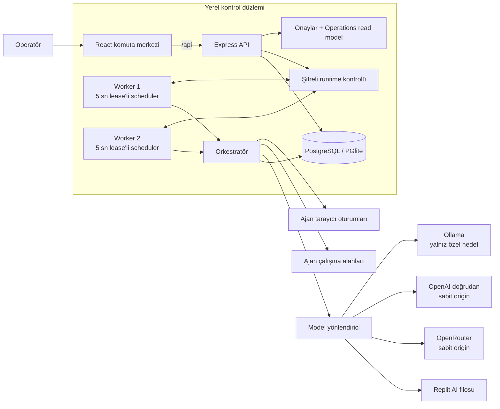

# Operatör ve geliştirici başvuru kaynağı

[← Başlangıç rehberi](../README.tr.md)

Teknik kurulum, yapılandırma ve çalışma ayrıntıları. İlk kurulum için README rehberinden başlayın.

## Bir bakışta mimari



Arayüz Vite/React uygulamasıdır. Production Compose; `start.mjs` üzerinden yalnız HTTP sunan bir API ve `start-worker.mjs` üzerinden yalnız scheduler çalıştıran iki bağımsız süreç başlatır; üçü de aynı PostgreSQL'i kullanır. API operatör kimlik doğrulamasını, kalıcı read model'leri, onayları ve kimliği doğrulanmış şifreli runtime-control kanalını yönetir. Worker'lar lease'li orkestrasyon turlarını ve sürece yerel araçları yürütür. `combined`, tek süreçli geliştirme uyumluluk modu olarak kalır. Görev, ajan, attempt, invocation ve runtime-instance lease'leri stale süreçleri fence eder. Kalıcı operation receipt'leri replay, idempotent, at-most-once safe-drop ve açık unknown-outcome reconciliation davranışları sağlar; proje yine de tüm dış etkiler için evrensel uçtan uca exactly-once iddiasında bulunmaz. Playwright oturumları ve element-ref registry'leri süreç yerelidir; komutlar tam runtime sahibine yönlendirilir. Ayrıntı için [docs/architecture.md](architecture.md) dosyasına bakın.

## Güvenlik duruşu

Varsayılanlar bilinçli olarak local-first'tür:

| Kontrol                     | Varsayılan                        | Anlamı                                                                                                                                |
| --------------------------- | --------------------------------- | ------------------------------------------------------------------------------------------------------------------------------------- |
| API ve Vite bind adresleri  | `127.0.0.1`                       | API, geliştirme UI'ı ve preview operatör host değişkenlerini açıkça değiştirmedikçe yalnızca hostta kalır.                            |
| Uzak API erişimi            | Reddedilir                        | Loopback dışı API; production, operatör auth, PostgreSQL, `ALLOW_REMOTE_ACCESS=true`, tam CORS origin'leri ve güvenilen host ister.   |
| Host/cross-site kontrolleri | Zorlanır                          | Bilinmeyen `Host` değeri `421`, cross-site durum değiştiren tarayıcı isteği `403` alır. Bunlar auth'u destekleyen ek katmanlardır.    |
| Ajan harici süreçleri       | Kapalı                            | Allowlist'teki binary'lerin çalışması için `ALLOW_AGENT_PROCESS_EXEC=true` gerekir. Sandbox içi dahili dosya komutları açık kalır.    |
| CEO host shell (`sudo`)     | Kapalı                            | Yalnız yerel kullanım; server-managed kök CEO, `canUseSudo`, runtime kapısı ve beş dakikalık birebir komut onayı gerektirir.          |
| Founder shell               | Kapalı                            | `ALLOW_FOUNDER_SHELL=true`, miras alınan ortamla tam host shell'i açar; uygulama içindeki root eşdeğeri yetki gibi ele alınmalıdır.   |
| Tarayıcı özel ağ erişimi    | Kapalı                            | Ana sayfa ve alt kaynak istekleri, tehlikeli kaçış anahtarı açılmadıkça yerel/özel/özel amaçlı hedefleri engeller.                    |
| Tarayıcı WebSocket'leri     | Kapalı                            | `AGENT_BROWSER_ALLOW_WEBSOCKETS=true` ile opt-in yapılır; public-target URL politikası yine uygulanır.                                |
| OpenRouter origin           | Sabit                             | Sağlayıcı anahtarı yalnızca `https://openrouter.ai/api/v1` adresine gönderilebilir; base URL arayüzden değiştirilemez.                |
| Doğrudan OpenAI origin      | Sabit                             | Sunucu `OPENAI_API_KEY` değerini yalnız `https://api.openai.com/v1` adresine gönderir; istek kimliği sırlar olmadan loglanır.         |
| Ollama hedefi               | Yalnız özel ağ                    | Tarayıcı hedef belirleyemez; sunucu yalnız localhost, `host.docker.internal`, RFC1918, loopback veya IPv6 ULA hedeflerini kabul eder. |
| CORS                        | Aynı origin + iki yerel dev adres | Ek tam origin'ler `CORS_ALLOWED_ORIGINS` gerektirir. CORS bir kimlik sınırı değil, defense-in-depth katmanıdır.                       |
| Kimlik doğrulama            | Tek operatör                      | Bearer login imzalı HttpOnly, SameSite=Strict cookie üretir; production 32+ karakter token ister. Kullanıcı/rol/MFA/tenant ACL yok.   |

Runtime onay kontrolleri korunan aracı araç/argüman hash'ine, göreve, ajana, süreye ve tek kullanıma bağlar. Tarayıcı yazma, sıradan bağlantı olmayan tıklama ve dahili `rm`/`del` onayları 30 dakika; CEO host-shell onayı beş dakika geçerlidir ve ayrıca hash kodunun elle doğrulanmasını ister. Sudo yolu onayı tüketmeden hemen önce canlı server-managed kök CEO kimliğini, yetkiyi, yalnız-loopback runtime kapısını, komut doğrulamasını ve ilk API süreci/host/fiziksel çalışma alanı bağını yeniden denetler; restart veya replika uyuşmazlığı eylemi güvenle düşürür. Onay tam shell metnini kapsar; çağrılan değişebilir scriptin, paket komutunun veya uzak kaynağın bütün geçişli etkisini sabitlemez. Shell mevcut API servis hesabının OS yetkisiyle ve daraltılmış ortamla çalışır; Windows UAC veya Unix privilege elevation yapmaz. Arka plan/alt süreçler gözlenen shell timeout'undan uzun yaşayabilir. Tarayıcıya yazmak formu örtük biçimde asla gönderemez: metin girişi ve tam gönder düğmesine tıklama, aralarında yeni snapshot alınan iki ayrı inceleme/onay adımıdır. Ajan çalışma alanı ve CEO host shell sertleştirilmiş VM/container sınırı değildir. Güçlü yetkileri açmadan önce [SECURITY.md](../SECURITY.md) ve [docs/security-model.md](security-model.md) dosyalarını okuyun.

Playwright oturumları ve snapshot-ref registry'leri, onları oluşturan worker sürecinde kalır. API tam runtime/session/epoch sahibini kaydeder ve tarayıcı komutunu yalnız bu sahibe ait kimliği doğrulanmış, şifreli runtime-control kanalı üzerinden gönderir; sahiplik tarayıcı istemcisinin sticky routing davranışına dayanmaz. Worker, korunan bir eylemden hemen önce yakalanmış sayfa/element bağını yeniden denetler. Ölmüş ya da yeniden başlamış sahip, eski snapshot, değişmiş hedef, eksik acknowledgement veya dispatch sonrası belirsiz sonuç başka bir runtime'a sessizce yönlendirilmez ve otomatik replay edilmez. İşlemin durduğu noktaya göre eylem güvenle düşürülür ya da açık operatör uzlaştırması ve gerektiğinde yeni snapshot/onay için kalıcı `unknown` durumuna alınır.

## Hızlı başlangıç

**Hazır konteyner kurulumu:** Node.js 24 kurun ve Docker Linux motoru ile Compose v2’yi başlatın. [Sürümlerden](https://github.com/halittayyar0/Agentic-Company-OS/releases/latest) kurulum ZIP’ini çıkarın. Windows’ta `START.cmd`, macOS/Linux’ta `sh START.command` çalıştırın. Yazılan özel bağlantıda dilini, modelini ve yetkilerini seç. Bu yol Git, pnpm veya kaynak derlemesi gerektirmez. [Başlangıç sayfası](https://halittayyar0.github.io/Agentic-Company-OS/) · [Verimli çalışma ve bütçeler](efficient-work.md).

**Kaynak koddan kurulum sihirbazı:** aşağıdaki gereksinimleri kurduktan sonra `pnpm install --frozen-lockfile` ve `pnpm run setup` çalıştırın. Tarayıcıda bilgisayar/container, yedi dil, model sağlayıcısı, yetki modu, araç paketleri ve isteğe bağlı özel telefon erişimi seçilir. [Kurulum ve yeniden başlatma](self-hosting.md#guided-installation-windows-linux-and-macos) belgesini inceleyin.

### Gereksinimler

- Node.js 24
- Corepack
- Kök `package.json` içindeki `packageManager` alanında belirtilen tam pnpm sürümü
- Tarayıcı araçları için Chrome, Edge veya uyumlu Chromium
- Production, uzak erişim, kalıcılık veya çoklu replika için PostgreSQL; yerel geliştirme süreç ömürlü gömülü PGlite ile çalışabilir

### 1. Kurulum

```bash
corepack enable
pnpm --version
pnpm install --frozen-lockfile
```

npm veya Yarn kullanmayın; lockfile ve workspace pnpm'e özeldir.

### 2. API'yi başlatma

API varsayılan olarak `5000` portunu kullanır. Sistem sağlayıcı olmadan açılabilir, fakat ajan turları için bir LLM sağlayıcısı gerekir.

PowerShell:

```powershell
$env:PORT = "5000"
$env:HOST = "127.0.0.1"
$env:OPENROUTER_API_KEY = "your_key_here"
pnpm --filter @workspace/api-server run dev
```

POSIX shell:

```bash
PORT=5000 \
HOST=127.0.0.1 \
OPENROUTER_API_KEY=your_key_here \
pnpm --filter @workspace/api-server run dev
```

Başka bir sağlayıcı yapılandırılmışsa `OPENROUTER_API_KEY` satırını atlayın. Doğrudan OpenAI `OPENAI_API_KEY`, yerel Ollama ise `http://127.0.0.1:11434/v1` gibi sunucu taraflı bir `OLLAMA_BASE_URL` kullanır. Ayrık API/worker dağıtımında Ayarlar, OpenRouter veya doğrudan OpenAI anahtarlarını `RUNTIME_CONTROL_KEY` ile korunan, kimliği doğrulanmış şifreli PostgreSQL envelope'u olarak saklar. Birleşik geliştirme modu gitignore kapsamındaki düz metin `data/runtime-config.json` uyumluluk dosyasını kullanmayı sürdürür; bu kolaylığı yalnızca güvenilen tek operatörlü makinede kullanın.

### 3. Arayüzü başlatma

İkinci terminali açın.

PowerShell:

```powershell
$env:PORT = "5173"
$env:LOCAL_API_TARGET = "http://127.0.0.1:5000"
pnpm --filter @workspace/agentic-company-os run dev
```

POSIX shell:

```bash
PORT=5173 \
LOCAL_API_TARGET=http://127.0.0.1:5000 \
pnpm --filter @workspace/agentic-company-os run dev
```

<http://127.0.0.1:5173> adresini açın. Backend'i ayrıca <http://127.0.0.1:5000/api/healthz> üzerinden doğrulayın.

> Güvenilen yerel API yapılandırması için `.env.example` dosyasını Git'in yok saydığı kök `.env` dosyasına kopyalayabilirsiniz. Paketlenmiş API başlatıcısı varsa bu dosyayı yükler; shell veya process manager tarafından önceden verilen değişkenler önceliklidir. Vite/UI değişkenlerini yine UI sürecine ayrıca verin. Production'da secret manager kullanın ve `.env` dosyasını asla commit etmeyin.

Vite geliştirme ve preview sunucuları varsayılan olarak `127.0.0.1` adresine bağlanır. `DEV_HOST` ve `PREVIEW_HOST` değerlerini loopback'te bırakın; Vite bir public deployment sunucusu değildir.

## Yapılandırma

Aşağıdaki tablo en sık değiştirilen kontrolleri özetler. [`.env.example`](../.env.example) repoya yazılmış dağıtım referansıdır ve her yükseltmede yeniden incelenmelidir; kaynak koddaki başlangıç doğrulaması son otoritedir.

| Değişken                                   | Zorunlu                    | Varsayılan                   | Amaç                                                                                                        |
| ------------------------------------------ | -------------------------- | ---------------------------- | ----------------------------------------------------------------------------------------------------------- |
| `PORT`                                     | Hayır                      | API `5000`; UI `5173`        | Dinleme portu. API ve UI süreçlerinde farklı değer kullanın.                                                |
| `NODE_ENV`                                 | Hayır                      | development                  | `production`; fail-closed doğrulama, secure cookie, HSTS ve yapılandırılmış log açar.                       |
| `HOST`                                     | Hayır                      | `127.0.0.1`                  | API bind adresi.                                                                                            |
| `OPERATOR_AUTH_TOKEN`                      | Production/uzak            | boş                          | 32-4096 karakter tek-operatör sırrı. Production'da `_FILE` varyantını tercih edin.                          |
| `OPERATOR_SESSION_TTL_MS`                  | Hayır                      | `43200000`                   | İmzalı oturum ömrü; beş dakika ile yedi gün arasında sınırlandırılır.                                       |
| `ALLOW_REMOTE_ACCESS`                      | Loopback dışı API          | `false`                      | API'nin loopback dışı bind kabul etmesi için tam olarak `true` olmalıdır.                                   |
| `TRUSTED_HOSTS`                            | Loopback dışı API          | loopback hostname'leri       | HTTP `Host` başlığında kabul edilen virgülle ayrılmış hostname'ler.                                         |
| `CORS_ALLOWED_ORIGINS`                     | Loopback dışı API          | boş                          | Tam tarayıcı origin'leri; uzak erişimde zorunludur.                                                         |
| `RUNTIME_ROLE`                             | Hayır                      | `combined`                   | `api` scheduler'ı zorla kapatır, `worker` açar; `combined`, `SCHEDULER_ENABLED` değerini kullanır.          |
| `SCHEDULER_ENABLED`                        | Yalnız combined            | loopback: açık; uzak: kapalı | Yalnız `RUNTIME_ROLE=combined` iken lease kontrollü scheduler seçimini yapar.                               |
| `RUNTIME_CONTROL_KEY`                      | Tüm PostgreSQL kurulumları | boş                          | İstek kimliği, şifreli Terminal çıktısı ve iç kontrol için ayrı 32–4096 karakter anahtar; yedeğini koruyun. |
| `RUNTIME_CONTROL_API_URL`                  | Worker rolü                | boş                          | Tam private-HTTP/HTTPS API kontrol adresi; worker dışarı doğru poll yapar ve port açmaz.                    |
| `MAX_TASK_STEPS`                           | Hayır                      | `0`                          | İsteğe bağlı ömür boyu adım sınırı; `0`, finite işi sonuç veya başka devre kesiciye kadar canlı tutar.      |
| `MAX_TASK_TOKENS`                          | Hayır                      | `100000`                     | Finite görev token sınırı; continuous ömür boyu kullanım ledger'da kalır.                                   |
| `MAX_TASK_REPORTED_COST_USD`               | Hayır                      | `1`                          | Finite görev maliyet sınırı; recurring iş için sağlayıcı bütçesi gerekir.                                   |
| `MAX_CONSECUTIVE_TASK_FAILURES`            | Hayır                      | `5`                          | Finite runtime hatalarını sınırlar; model/sağlayıcı kesintisi kalıcı kuyrukta kalır.                        |
| `LLM_REQUEST_TIMEOUT_MS`                   | Hayır                      | `120000`                     | Sağlayıcı çağrısı için 5 saniye ile 10 dakika arasında sınırlandırılan kesin deadline.                      |
| `MODEL_FALLBACK_MAX_ROUTES`                | Hayır                      | `3`                          | Mantıksal görev adımı başına maliyet uyumlu model rotası; 1-4 aralığına sıkıştırılır.                       |
| `MODEL_RETRY_ATTEMPTS_PER_ROUTE`           | Hayır                      | `2`                          | Geçici inference hatalarında rota başına deneme; 1-3 aralığına sıkıştırılır.                                |
| `MODEL_RETRY_BASE_DELAY_MS`                | Hayır                      | `750`                        | Adım içi üstel retry tabanı; her bekleme en fazla 5000 ms'dir.                                              |
| `MAX_AGENT_TOOL_CALLS_PER_ROUND`           | Hayır                      | `8`                          | Büyük model araç batch'ini ilk çağrı çalışmadan reddeder; 1-32 aralığına sıkıştırılır.                      |
| `MAX_ACTIVE_AGENTS`                        | Hayır                      | `64`                         | Runtime kontrol kilidi altında uygulanan global aktif ajan kapasitesi.                                      |
| `MAX_OUTSTANDING_TASKS`                    | Hayır                      | `500`                        | Kuyruktaki ve çalışan durumlar için global açık görev kapasitesi.                                           |
| `MAX_OUTSTANDING_APPROVALS`                | Hayır                      | `200`                        | Global bekleyen onay kapasitesi.                                                                            |
| `MAX_MESSAGES_PER_AGENT`                   | Hayır                      | `5000`                       | Ajan başına kalıcı mesaj saklama devre kesicisi.                                                            |
| `MAX_COMPANY_MESSAGES`                     | Hayır                      | `50000`                      | Global kalıcı Şirket Odası mesaj sınırı; pozitif değerler en fazla 1000000 olabilir.                        |
| `COMPANY_CHAT_MAX_RESPONSE_ATTEMPTS`       | Hayır                      | `6`                          | Kurucu mesajı başına yanıt-gerekli model kapısı; odada `MAX_ACTIVE_AGENTS` dışında ayrı sınır yoktur.       |
| `COMPANY_CHAT_RESPONSE_CONCURRENCY`        | Hayır                      | `1`                          | Sınırlı oda yanıt havuzu; sonraki üye önceki yanıtı görsün diye varsayılan sıralıdır.                       |
| `COMPANY_CHAT_RESPONSE_MAX_TOKENS`         | Hayır                      | `400`                        | Tek bir Şirket Odası yanıtının azami completion token değeri.                                               |
| `COMPANY_CHAT_RESPONSE_TOKEN_BUDGET`       | Hayır                      | `2400`                       | Tek bir Şirket Odası dağıtımı için toplam completion-token rezervi.                                         |
| `PROJECT_MEETING_MAX_RESPONDERS_PER_START` | Hayır                      | `8`                          | Toplantı başlangıcı araçsız tur sınırı; katılımcı listesi global aktif-ajan kapasitesine uyar.              |
| `PROJECT_MEETING_MAX_CONCURRENT_STARTS`    | Hayır                      | `2`                          | Aynı veritabanını kullanan API örneklerinin ortak canlı toplantı sınırı; 1-16 aralığındadır.                |
| `DEV_HOST` / `PREVIEW_HOST`                | Hayır                      | `127.0.0.1`                  | Vite geliştirme/preview bind adresleri. Loopback'te bırakın.                                                |
| `DEV_ALLOWED_HOSTS`                        | Hayır                      | Vite güvenli varsayılanları  | Vite geliştirme/preview sunucusunun kabul ettiği hostname'ler.                                              |
| `LOCAL_API_TARGET`                         | Yalnız yerel UI            | `http://127.0.0.1:5000`      | Replit dışı Vite geliştirmede `/api` çağrılarını yerel API'ye proxy'ler.                                    |
| `OPENROUTER_API_KEY`                       | Sağlayıcıya bağlı          | boş                          | OpenRouter'ı açar. Asla commit etmeyin.                                                                     |
| `APP_PUBLIC_URL`                           | Hayır                      | boş                          | OpenRouter `HTTP-Referer` atfı için doğrulanmış origin; API origin'ini değiştirmez.                         |
| `OPENAI_API_KEY`                           | Sağlayıcıya bağlı          | boş                          | Kodda sabitlenmiş ilk taraf API origin'inde doğrudan OpenAI'ı açar. Asla commit etmeyin.                    |
| `OPENAI_MODEL_IDS`                         | Hayır                      | boş                          | Sunucu yöneticisinin ek doğrudan OpenAI model izin listesi.                                                 |
| `OLLAMA_BASE_URL`                          | Sağlayıcıya bağlı          | boş                          | Yalnız doğrulanmış localhost/özel ağ hedefinde yerel Ollama'yı açar.                                        |
| `AI_INTEGRATIONS_OPENAI_API_KEY`           | Sağlayıcıya bağlı          | boş                          | Replit AI entegrasyon anahtarı.                                                                             |
| `AI_INTEGRATIONS_OPENAI_BASE_URL`          | Sağlayıcıya bağlı          | boş                          | Replit AI entegrasyon endpoint'i.                                                                           |
| `DATABASE_URL`                             | Production/uzak            | dev'de in-memory PGlite      | PostgreSQL bağlantısı; versioned migration zinciri advisory lock altında uygulanır.                         |
| `ALLOW_AGENT_PROCESS_EXEC`                 | Hayır                      | `false`                      | Ajan alanında allowlist'teki harici süreçleri etkinleştirir.                                                |
| `ALLOW_AGENT_SUDO`                         | Hayır                      | `false`                      | Yalnız yerel CEO host shell yolunu açar; kök kimlik, yetki ve birebir onay da gerekir.                      |
| `ALLOW_FOUNDER_SHELL`                      | Hayır                      | `false`                      | Founder terminalinden sınırsız host shell'i etkinleştirir.                                                  |
| `AGENT_SANDBOX_ROOT`                       | Hayır                      | `./agent-sandboxes`          | Taban dizini değiştirir; boş değer export etmek yerine değişkeni tanımlamayın.                              |
| `AGENT_BROWSER_CHANNEL`                    | Hayır                      | otomatik                     | `chrome`, `msedge` veya `chromium`.                                                                         |
| `AGENT_BROWSER_HEADLESS`                   | Hayır                      | headless                     | Pencereleri göstermek için tam olarak `false` yapın.                                                        |
| `AGENT_BROWSER_ALLOW_PRIVATE_NETWORKS`     | Hayır                      | `false`                      | Tarayıcıya yerel/özel ağ hedeflerini açan tehlikeli opt-in.                                                 |
| `AGENT_BROWSER_ALLOW_WEBSOCKETS`           | Hayır                      | `false`                      | Aynı public-target kontrolünden sonra `ws:`/`wss:` bağlantılarını açar.                                     |
| `MAX_BROWSER_SESSIONS`                     | Hayır                      | `4`                          | Runtime süreci başına canlı ajan tarayıcı oturumu sınırı.                                                   |
| `BROWSER_SESSION_IDLE_MS`                  | Hayır                      | `900000`                     | Bu boşta kalma süresinden sonra oturumu kapatır; minimum 60000 ms.                                          |
| `EMERGENCY_STOP_MONITOR_MS`                | Hayır                      | `20000`                      | Scheduler kapalı olsa da kalıcı acil durdurmayı her replikada uygulama aralığı.                             |
| `API_RATE_LIMIT_MAX`                       | Hayır                      | `300`                        | Süreç başına API istek penceresi; replikalarda dağıtık edge limiti de kullanın.                             |
| `AUTH_RATE_LIMIT_MAX`                      | Hayır                      | `10`                         | Süreç başına auth penceresindeki login denemesi.                                                            |
| `LOG_LEVEL`                                | Hayır                      | `info`                       | Pino log seviyesi.                                                                                          |
| `BASE_PATH`                                | Hayır                      | `/`                          | Vite frontend build taban yolu.                                                                             |

Kalıcı depolama ve özel ağ kurulumu için [docs/self-hosting.md](self-hosting.md) dosyasına bakın.

Her sohbet, görev adımı ve judge completion'ında normal muhasebe yolu; sağlayıcı/model atfı ile normalize edilmiş prompt, completion ve toplam token alanlarını içeren bir `usage_events` satırı yazar. Sağlayıcının raporladığı alanlar yerel tahmin yapılmadan korunur. OpenRouter'ın sağlayıcı-raporlu maliyeti doğrudan saklanır; diğer sağlayıcı maliyetleri fiyat tablosundan uydurulmak yerine `null` kalır. Ledger yazma hatası loglanır ve model çağrısını geri almaz. Görev devre kesicileri scheduler adımları arasında değerlendirilen yerel güvenlik sınırlarıdır, sağlayıcı faturası garantisi değildir; sağlayıcı tarafı bütçe ve uyarıları açık tutun.

## Ajan promptları ve yetkiler

Varsayılan kimlikler `artifacts/api-server/src/lib/agent-templates.ts` içindedir. Çalışma anında kayıtlı ajan promptu şunlarla birleştirilir:

1. ajan kimliği ve departmanı,
2. düzenlenebilir rol promptu,
3. güncel yönetici/raporlama ilişkileri,
4. son görev bağlamı ve aktiviteler,
5. açık çalışma alanı/tarayıcı talimatları,
6. organizasyon genelindeki güvenlik ve iletişim kuralları.

Prompt değişikliği ürün davranışı değişikliğidir. Özellikle dış iletişim, silme, yayınlama, harcama, kimlik bilgileri veya araç kullanımıyla ilgili metinleri kod kadar dikkatli inceleyin.

Yetki bayrakları alt ajan oluşturmayı, delegasyonu, terminali, tarayıcı araçlarını ve CEO host shell'i sınırlar. Harcama, silme, yayınlama ve dış iletişim onay talepleri de ilgili canlı yetki kapalıysa sunucu tarafından reddedilir. `canUseSudo` tek başına yetki değildir: server-managed canonical kök CEO işareti ve yapısal kimlik, `ALLOW_AGENT_SUDO=true`, yalnız-loopback runtime, ilk süreç/host/fiziksel çalışma alanı bağı, beş dakikalık birebir komut kapsamı, elle hash doğrulaması ve tek kullanımlık tüketim birlikte uyuşmalıdır. Runtime tarayıcıya yazma, güvenli olmayan tıklama ve yıkıcı VM komutlarında da tam kapsamlı onay ister. Bu kontroller her olası yan etkiyi değil, uygulanmış eylem yollarını kapsar. Ajan promptunu veya permission JSON'unu güvenlik sınırı saymayın.

## Depo haritası

```text
artifacts/agentic-company-os/   React/Vite operatör konsolu
artifacts/api-server/           HTTP API ve bağımsız worker, orkestrasyon, VM/tarayıcı runtime
lib/ai-server/                  Model kataloğu, sağlayıcı istemcileri, yönlendirme
lib/api-spec/                   OpenAPI kaynak sözleşmesi
lib/api-client-react/           Üretilmiş React API istemcisi
lib/api-zod/                    Üretilmiş istek/yanıt şemaları
lib/db/                         Drizzle şeması ve veritabanı bootstrap
scripts/                        Workspace yardımcıları
docs/                           Mimari, güvenlik, hosting ve yol haritası
```

## Geliştirme kalite kapıları

```bash
pnpm run verify
```

Yerel release kapısı formatı, production bağımlılık/lisans denetimlerini, otomatik keşfedilen tüm testleri, temiz PGlite migration'ını, typecheck'i, build'i ve bundle bütçesini çalıştırır. GitHub Actions ayrıca deterministik OpenAPI üretimini doğrular, migration'ları gerçek PostgreSQL'e uygular, SHA-256 ile sabitlenmiş PostgreSQL 17 Windows araç zincirini indirip gerçek native smoke/doğrulayıcı yolunu çalıştırır ve production container'ını build eder. Container CI bir API ile iki bağımsız worker başlatır, öldürülen worker'ın stale olduktan sonra yeni incarnation ile filoya döndüğünü kanıtlar; dayanıklılık yolu tek prebuilt imajı `--no-build` ile kullanıp çalışan imaj kimlikleri ile OCI kaynak etiketlerini doğrular. Güvenlik regresyon paketi auth/rate limit, Host/cross-site, browser SSRF, sandbox traversal/symlink, emergency stop, ajan süreç çalıştırma ve founder-shell varsayılanlarını kapsar. CodeQL ile secret scan ayrı düşük yetkili workflow'lardır.

Depoda ayrıca deterministik hızlandırılmış kanıt ile Docker ve yerel Windows PostgreSQL wall-clock sürücüleri bulunur. Kısa smoke raporu yararlıdır fakat bilerek `verified24h: false` kalır; yalnız gerçekten en az 24 saat geçen ve bağımsız doğrulayıcının sorumluluk, receipt, stale-owner, recovery, olay, sağlık, SSE, tarayıcı manifesti/checkpoint baytı, journal, SHA, topoloji, runtime provenance ve commit kapılarının tamamını kabul ettiği koşu 24 saatlik kanıttır. Kesin komutlar ve kanıt yolları için [Dayanıklılık doğrulaması](endurance.md) belgesine bakın.

OpenAPI sözleşmesi değiştiğinde istemci ve şemaları yeniden üretin:

```bash
pnpm --filter @workspace/api-spec run codegen
pnpm run typecheck
```

## Proje durumu

Agentic Company OS; fail-closed auth, versioned migration, ayrılmış API/worker süreçleri, kalıcı operation receipt'leri, probe, istek sınırı ve container artifact'ları içeren tek-operatör private-server profiline sahip 1.0 öncesi, yerel öncelikli bir üründür. Yakın dönem öncelikleri çok kullanıcılı yetkilendirme, disposable araç sandbox'ları, evrensel yan-etki politikası, dağıtık kotalar, düzenli recovery drill'leri ve daha geniş uçtan uca testlerdir. Ürün işleri [yol haritasında](roadmap.md), kalan riskler [güvenlik modelinde](security-model.md) izlenir.

## Katkı

Katkılar açıktır. [CONTRIBUTING.md](../CONTRIBUTING.md) ile başlayın, [Davranış Kuralları](../CODE_OF_CONDUCT.md) belgesine uyun ve güvenlik açıklarını [SECURITY.md](../SECURITY.md) içindeki özel kanaldan bildirin.

## Lisans

[MIT Lisansı](../LICENSE) ile lisanslanmıştır.

Paketlenen IBM Plex font dosyaları SIL Open Font License 1.1 kapsamında kalır; dağıtıma dahil bildirim [THIRD_PARTY_NOTICES.txt](../artifacts/agentic-company-os/public/THIRD_PARTY_NOTICES.txt) dosyasındadır.

## Birlikte kur, genişlet ve geliştir

`pnpm install --frozen-lockfile` ardından `pnpm run setup` çalıştırın. Kurulumda bilgisayar veya konteyner, yedi dil, model sağlayıcısı, izin seviyesi ve araç paketleri seçilir. Kişisel rehber, hazır araç ayarı veya kendi Node aracınızı oluşturup JSON olarak paylaşabilirsiniz; [çalıştırılabilir araçlar](personal-programs.md) izin ve kayıt sisteminden geçer.

Ayarlar bölümündeki [kaynak kodu çalışma alanı](source-workspaces.md), ajana ayrı bir Git kopyası verir. Test edilen değişikliği inceleyip asıl depoya uygulayabilir ve geri alma kaydı oluşturabilirsiniz. Çalışan uygulamanın yeniden dağıtılması ile veritabanı göçlerinin geri alınması ayrıca yönetilir.
