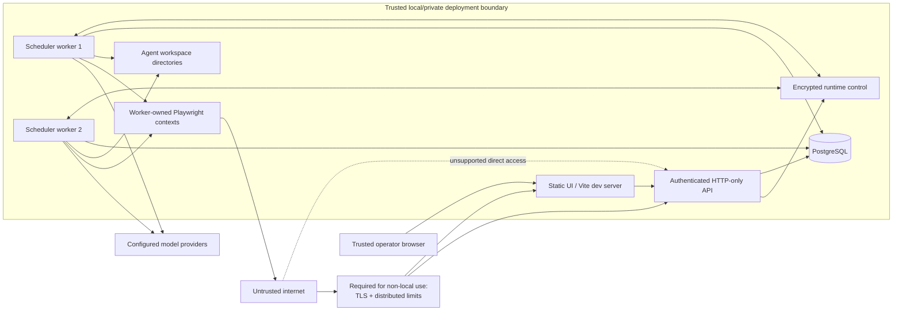

# Security Model

Agentic Company OS is a local-first alpha that gives models access to useful tools. Its safe operating model is a trusted operator running a controlled local or private deployment; the API and every worker must share durable PostgreSQL for lease, receipt, and runtime-control coordination. This document separates implemented controls from assumptions and known gaps.

For vulnerability reporting, use [SECURITY.md](../SECURITY.md).
The code-level production checklist is maintained in
[runtime-safety-invariants.md](./runtime-safety-invariants.md).

## Executive summary

- The API, Vite development server, and Vite preview bind to `127.0.0.1` by default.
- Production and non-loopback API startup require a strong operator token and PostgreSQL; non-loopback also requires production mode, explicit remote access, exact CORS origins, and trusted hosts.
- Untrusted `Host` values and cross-site state-changing browser requests are rejected before routing.
- Agent external process execution, CEO host shell, and founder host shell are disabled by default.
- OpenRouter and direct OpenAI credential traffic is pinned to each provider's first-party API origin; OpenAI request IDs are logged without prompts or secrets.
- Ollama targets are server-only configuration restricted to explicit local/private hosts, and unverified model tool capability fails closed.
- Agent files are rooted in per-agent directories with size, traversal, and pre-existing symbolic-link checks.
- Browser navigation and subresources are restricted to public HTTP(S) targets by default; WebSockets default off and sessions are capped/idle-expired.
- Production Compose separates one HTTP-only API from two scheduler-only workers. PostgreSQL-backed task, agent, attempt, invocation, and runtime-instance leases prevent ordinary cross-process double claims and fence stale owners.
- Durable operation receipts distinguish transactional, idempotent, at-most-once, and approval-bound effects. They support safe replay/recovery and explicit `unknown` reconciliation without claiming universal exactly-once external effects.
- Playwright state stays process-local, but the API records its exact runtime/session/epoch owner and routes commands through that worker's authenticated, encrypted runtime-control channel. Browser-client sticky routing is not the ownership control.
- Exact, expiring, single-use approval scopes are enforced for CEO host-shell command strings, browser typing, unsafe clicks, and destructive built-in VM commands.
- Completion judge failure blocks completion; approval judge failure warns while preserving the independent human gate.
- Per-completion token telemetry is ledgered, with provider-reported cost stored only when actually supplied.
- Production/remote mode fails closed without a 32+ character single-operator token; protected routes accept bearer or signed HttpOnly cookie authentication.
- Approval enforcement covers specific runtime paths, not every possible external side effect; the LLM judge remains model-based oversight.
- Agent workspaces are not hardened VMs, and the browser filter is not a substitute for network isolation.

The system remains a single-operator alpha; put TLS, a firewall, and distributed abuse controls in front of any remote deployment.

## Scope and trust assumptions

### Trusted

- The operator who can reach the UI/API.
- The host administrator and deployment environment.
- Environment configuration, including the Replit AI base URL.
- The selected PostgreSQL service and secret manager.
- Reviewed repository code and locked dependencies.

### Untrusted

- Model output and tool arguments.
- Web pages, search results, documents, and other content read by an agent.
- User-supplied prompt text and imported task content.
- Workspace files unless created and reviewed locally.
- Activity/log text when rendered or exported.
- Network clients outside the trusted operator boundary.
- Pull-request code and third-party dependencies until reviewed and scanned.

### Not provided by the current repository

- Multi-user accounts, roles, tenant isolation, MFA, recovery, or server-side session revocation lists.
- A hardened process/container sandbox.
- A complete browser destination allowlist or OS/network-enforced egress gateway. Chromium does use an application resolving proxy that validates DNS answers and pins a public IP.
- A universal side-effect authorization engine.
- Per-user/distributed quotas or a provider-enforced global billing cutoff. Per-process API/login limits and task circuit breakers are implemented but are not billing guarantees.
- An immutable audit ledger.
- Disaster recovery automation or tamper-evident backups. A checked-in migration chain and startup advisory lock are implemented.

## Guided connection branch (unreleased)

The development branch adds protected ChatGPT registration and optional native
Codex execution. These controls are absent from the published v0.3.13 package.

- Sign-in validates PKCE/state/nonce, signed identity and permission grants.
  Account saving and selection remain separate; identity-only access cannot
  authorize inference. Personal Codex credentials are never imported implicitly.
- Credentials stay in encrypted backend storage or an owner-private development
  store. Durable refresh locks and revision checks prevent stale token rotation.
  Server handoff uses protected files and SSH, with no browser upload endpoint.
- Connection dialogs keep API keys in memory until backend saving and clear them
  on close. Persisted job drafts reject credential fields; public status and
  recovery contracts omit private homes, tokens and native thread identities.
- Native tasks require separate operator opt-ins, backend-selected workspaces,
  named permissions and live lease/account authority. Unknown cleanup blocks
  replay and source mutation. Exact action approvals do not replace OS enforcement.
- Actual offline Linux tests verify lifetime cleanup, fixed command permissions,
  private-file denial and no inference after final admission refusal. This is
  neither live-model acceptance nor a claim that arbitrary hostile code is safe.
  Tested Windows named-profile refusal, macOS and container coding acceptance
  remain unresolved. Unsupported preparation fails before inference.

Read the [connection guide](./chatgpt-connection.md) for precise prerequisites,
handoff rules and verification limits. These additions do not introduce multiple
operators, tenant isolation or a provider-enforced billing ceiling.

## Assets

The primary assets are:

1. provider API keys and model budget;
2. host filesystem, environment, and OS account authority;
3. agent workspace files;
4. browser session state and external accounts/data reachable through allowed public-web destinations;
5. organization prompts, messages, tasks, approvals, and activity history;
6. token/cost usage telemetry;
7. PostgreSQL data and backups; and
8. repository and CI integrity.

## Trust boundaries

The **ingress** reverse proxy shown above is not included. For non-local deployment it must terminate TLS, apply distributed limits, and prevent a direct network bypass around the built-in authentication boundary. This is separate from the built-in loopback resolving proxy used to constrain agent-browser egress.

## Implemented controls and limits

| Area                      | Implemented control                                                                                                                                                                                                                                                                                                                                              | Limit / residual risk                                                                                                                                                                                |
| ------------------------- | ---------------------------------------------------------------------------------------------------------------------------------------------------------------------------------------------------------------------------------------------------------------------------------------------------------------------------------------------------------------- | ---------------------------------------------------------------------------------------------------------------------------------------------------------------------------------------------------- |
| API exposure              | API and Vite default to loopback. Production/non-loopback startup requires a strong operator token and PostgreSQL; non-loopback additionally requires remote opt-in, exact CORS origins, and trusted hosts.                                                                                                                                                      | One shared operator secret grants complete control; there is no tenant/object authorization, MFA, or session revocation list.                                                                        |
| Host/origin access        | Unknown `Host` values return `421`; cross-site mutations return `403`; CORS allows same-origin, two fixed local dev origins, or exact configured origins.                                                                                                                                                                                                        | These are DNS-rebinding/cross-site defenses, not authentication, and do not stop direct clients with permitted headers.                                                                              |
| HTTP baseline             | `x-powered-by` disabled; CSP, HSTS in production, `nosniff`, frame deny, no-referrer, restrictive permissions policy, 1 MiB body limit, bounded per-process API/login throttling, and no-store API responses.                                                                                                                                                    | Rate state is process-local and not a distributed quota; there is no per-user authorization.                                                                                                         |
| OpenRouter credentials    | Base URL is a code constant at `https://openrouter.ai/api/v1`; optional `APP_PUBLIC_URL` contributes only a validated credential-free origin attribution header.                                                                                                                                                                                                 | A caller that reaches settings can replace/remove the stored key. Provider prompts/data still leave the host.                                                                                        |
| Direct OpenAI credentials | Base URL is fixed at `https://api.openai.com/v1`; keys remain server-side and masked in settings; generated client/server request IDs are logged through a metadata-only observer.                                                                                                                                                                               | A caller with full operator access can replace/remove the stored key. Prompts/data leave the host and provider request IDs remain operational metadata.                                              |
| Ollama endpoint           | Browser requests cannot set the endpoint. Validation permits only exact local aliases or private IP literals, rejects URL credentials/query/hash/public/link-local targets, constrains paths, and disables catalog redirects. Model tool support must be reported by `/api/show`.                                                                                | A trusted server administrator still chooses a private data-egress target; application validation is not a network firewall, and the local model/runtime may be malicious.                           |
| Replit credentials        | Base URL and key come from environment configuration.                                                                                                                                                                                                                                                                                                            | A malicious or mistaken environment base URL can receive the configured key; environment config is trusted admin input.                                                                              |
| Provider configuration    | Split roles store OpenRouter/OpenAI keys as an authenticated encrypted envelope in PostgreSQL and track per-runtime revision acknowledgements. Combined development mode retains the gitignored, size/type-validated, atomically replaced `data/runtime-config.json` compatibility file.                                                                         | `RUNTIME_CONTROL_KEY` is required to decrypt split-role data and has deployment-wide authority. The combined-mode file is plaintext; Windows ACLs and backups require operator control.              |
| Agent avatars             | Custom images are client-cropped and compressed, then server-validated as bounded PNG/JPEG/WebP with matching file signatures. SVG and remote URLs are rejected; bytes live outside roster DTOs behind an authenticated, versioned endpoint with private ETag caching.                                                                                           | Browser-side re-encoding is a usability optimization, not a trust boundary. The API enforces type and 64 KiB payload size but is not a general-purpose malware scanner.                              |
| Agent processes           | External binaries require `ALLOW_AGENT_PROCESS_EXEC=true`; allowlist, no shell, timeout, output cap, reduced environment, and tree/process-group termination while the tracked root remains addressable.                                                                                                                                                         | A root can exit after orphaning a child (especially without a Windows Job Object). Detached/PID-namespace escapes require container/VM isolation.                                                    |
| CEO host shell            | Requires the singular server-managed canonical root CEO, `canUseSudo`, a loopback-only API, `ALLOW_AGENT_SUDO=true`, same-process/host/physical-workspace affinity, five-minute exact-string approval, typed hash confirmation, single consumption, and best-effort tree cleanup.                                                                                | Runs with the API service account's authority. It is not privilege elevation or containment; mutable referenced content and deliberately detached processes remain risks.                            |
| Founder shell             | Requires `ALLOW_FOUNDER_SHELL=true`.                                                                                                                                                                                                                                                                                                                             | Once enabled, it is a platform shell with inherited environment and full OS-account authority.                                                                                                       |
| Workspace paths           | Relative paths are resolved beneath an agent-specific root; root deletion, lexical traversal, root/component symbolic links, and screenshot-evidence symlink escapes are rejected; file/read/list/binary limits apply. Persistent cwd commands are serialized per agent.                                                                                         | Directories share one OS account. Link checks are not kernel isolation and cannot contain an enabled interpreter or other host process.                                                              |
| Runtime control           | Split roles require a shared 32-4096 character `RUNTIME_CONTROL_KEY`. Workers authenticate outbound long polls to the API; sensitive command/ack payloads use authenticated encryption, are addressed to one runtime incarnation, and are not persisted in plaintext. Workers need no operator bearer or inbound HTTP port.                                      | The symmetric key is high-value deployment authority. Rotation is a coordinated restart, and encryption does not make a compromised API/worker host trustworthy.                                     |
| Agent browser             | Permission-gated tools; worker-local contexts/ref registries; durable runtime/session/epoch ownership; exact-owner encrypted dispatch; atomic agent/operator ownership with a masked lease; bounded operator FIFO; public HTTP(S) checks; resolving proxy; QUIC/non-proxied WebRTC off; WebSockets off; downloads/service workers blocked; session cap/idle TTL. | The proxy is not an OS network sandbox. Owner loss can safe-drop or create an `unknown` outcome; the session is not migrated or retried on another worker.                                           |
| Agent tools               | Creation, delegation, terminal, and browser tools are selected and rechecked from live permissions. Spend, delete, publish, and external-contact approval categories also require the matching permission.                                                                                                                                                       | Permission/category checks cover implemented paths; they are not a universal side-effect policy engine.                                                                                              |
| Approvals                 | Browser typing, non-plain-link clicks, and destructive built-in VM commands require an approved exact tool/argument scope tied to task+agent, expiring in 30 minutes and consumed once. Browser approvals also bind the runtime incarnation, session, epoch, snapshot nonce, and captured element/page identity.                                                 | Owner loss or an ambiguous post-dispatch result can safe-drop or leave an `unknown` outcome after consumption. Other external-action paths are not universally intercepted.                          |
| Compliance judge          | Reviews completion/approval text with bounded model fallback; completion blocks if every route errors, remains malformed, or returns a blocking verdict; approval-review errors warn and still require human approval.                                                                                                                                           | Only selected text is reviewed by a model. A pass is not proof of truth or safety, and warnings still require operator judgment.                                                                     |
| Scheduling and effects    | Task/agent/attempt/invocation/runtime leases coordinate PostgreSQL-backed workers and fence stale commits. Operation receipts bind canonical logical and replay identities, atomically include transactional mutations, preserve idempotency keys, and stop automatic replay of uncertain at-most-once effects pending reconciliation.                           | PGlite cannot coordinate processes. Receipts describe application knowledge, not external truth, and cannot provide universal end-to-end exactly-once execution.                                     |
| Usage and budgets         | Per-completion provider/model token fields; OpenRouter-reported cost; task step/token/reported-cost limits; repeated-failure cutoff.                                                                                                                                                                                                                             | Missing provider telemetry is not estimated; judge/chat usage is separate from task-step aggregates; checks occur between steps and can overshoot.                                                   |
| Persistence               | Production requires PostgreSQL. Startup checks connectivity and applies versioned migrations under an advisory lock; hot-path indexes, foreign keys, enum/numeric checks, and legacy-data preflight are checked in. PGlite runs the same chain in development.                                                                                                   | PGlite is process-lifetime. Database confidentiality, TLS, backups, restore testing, and retention remain operator responsibilities.                                                                 |
| Emergency stop            | A versioned PostgreSQL singleton blocks new task/tool execution. Every replica polls independently of its scheduler and retries local child/browser cleanup; API retries force local repair.                                                                                                                                                                     | Polling is not instantaneous, already-completed external effects cannot be recalled, and force-killing child processes is best-effort OS containment.                                                |
| Endurance adapter         | Synthetic execution is rejected by the ordinary production image. The dedicated Docker target requires a root-owned marker plus a run-scoped control file; the native harness is loopback-only development mode.                                                                                                                                                 | The marker is a runtime-code deployment guardrail, not cryptographic image attestation. A root-controlled operator can replace code, images, or mounts; provenance/signing remain external controls. |
| Observability             | Activity records cover state changes, judge results, and real computer lifecycle phases. Raw terminal commands/output, browser text input, and URL query/fragment secrets are omitted from durable computer events; known command/credential fields are log-redacted. Stale running rows are reconciled after restart.                                           | Not immutable; model text and page titles/paths can still contain sensitive or misleading content. No Prometheus/OpenTelemetry endpoint is built in.                                                 |

## Threat analysis

### 1. Unauthorized control-plane access

**Threat:** A network client reaches API routes and can read conversations, change prompts/settings, resolve approvals, operate browsers, or mutate agent workspaces.

**Current mitigation:** Loopback defaults; production/remote fail-closed token requirement; bearer and signed HttpOnly `SameSite=Strict` sessions; explicit non-loopback opt-in; trusted-host/origin checks; and login/API rate limits.

**Required operator controls:** Keep loopback for local use. For remote use, retain built-in auth, terminate TLS, add distributed limits, rotate the operator token, and firewall the direct API. Do not treat the single token as multi-user authorization.

### 2. Credential disclosure

**Threat:** Keys appear in Git, logs, error messages, activity details, browser content, workspace files, backups, or are sent to a redirected provider.

**Current mitigation:** `.gitignore`, `.env.example` placeholders, masked settings responses, OpenRouter/OpenAI origin pinning, metadata-only OpenAI request logging, no browser-settable provider URL/header fields, Ollama private-target validation, authenticated encryption for the split-role PostgreSQL provider envelope, and restrictive local runtime file mode where available in combined development.

**Required operator controls:** Prefer a process secret manager; restrict the service account and backup readers; avoid placing secrets in prompts/tasks; rotate on suspected exposure; enable repository secret scanning and push protection. Treat the Replit base URL and Ollama private endpoint as trusted secret/data-routing configuration, and enforce their egress destinations at the network layer.

### 3. Prompt injection and confused-deputy actions

**Threat:** A webpage or document tells an agent to ignore policy, disclose data, execute a command, contact an external party, or misreport completion.

**Current mitigation:** Organization prompt rules, capability selection, activity visibility, purpose-aware judge review, and runtime-enforced approval scopes for CEO host-shell command strings, agent browser typing, non-plain-link clicks, and destructive built-in VM commands. Scopes bind the task, agent, tool, and argument hash and are atomically consumed once. Browser/VM scopes expire after 30 minutes. CEO host-shell scopes expire after five minutes, require a typed digest prefix, and additionally bind the originating API-process instance, host, and resolved physical workspace. A protected browser action is addressed to the exact durable runtime/session/epoch owner through authenticated encrypted control; that worker requires the captured handle to remain connected and its live page/element binding to match the approved binding. Typing is fill-only: it cannot submit with Enter or an implicit form action, and submitting requires a fresh snapshot plus a separate exact-control approval. Sensitive password/OTP/card-like browser fields remain agent-blocked.

**Residual risk:** Models can disobey instructions, and not every external-action path is intercepted. Plain-link navigation, public-web reads, enabled host processes, file overwrites, and target-site behavior can still have side effects. Browser sessions/ref registries are worker-local: owner loss can safe-drop an already consumed approval or leave an ambiguous receipt requiring reconciliation, but strict ownership prevents silent retargeting and automatic replay elsewhere. The model judge sees selected text and can make incorrect pass/warn/block decisions.

**Required operator controls:** Assign minimum permissions, use unprivileged browser sessions, avoid sensitive data in model context, inspect the exact target/preview before approving, independently verify high-impact completion claims, and isolate execution. Extend the same scoped-capability pattern to every material side-effect path before treating approvals as a universal policy boundary.

### 4. Workspace escape and host execution

**Threat:** Crafted paths, filesystem links, interpreters, package lifecycle scripts, Git hooks, or shell metacharacters reach outside the intended workspace.

**Current mitigation:** Lexical root checks, rejection of pre-existing symbolic-link paths, restricted built-in parser, forbidden command characters, process allowlist, `shell: false`, scrubbed process environment, timeouts, size caps, and process spawning off by default. While the tracked root remains addressable, timeout, cancellation, and emergency stop target Windows process trees or dedicated POSIX process groups with TERM-to-KILL escalation. The separately gated CEO host shell is canonical-root-only, local-only, command-length/control-character validated, approval/host bound, and launched with a minimal environment; known secret-shaped output is redacted and persisted sudo audit data is minimized.

**Residual risk:** Filesystem path rooting is not OS isolation. Once an interpreter/package tool or CEO host shell is enabled, arbitrary code can generally exercise the API service account's authority. Sudo approval fixes only the submitted shell string: referenced files, package scripts, executables, and network responses can change after review. A root process can exit naturally after orphaning a child before the application can traverse it, particularly on Windows without a Job Object; deliberate detach, PID-namespace escape, or kernel/runtime compromise likewise defeats application cleanup. Default both execution gates off and use a dedicated container/VM with cgroup/PID containment. Redaction cannot make a host containing unrelated secrets safe.

**Required operator controls:** Leave process execution off on a normal workstation. If required, run the entire API/runtime in a disposable, unprivileged container or VM with read-only host mounts, resource limits, seccomp/AppArmor or equivalent, and restricted network/filesystem access. Do not mount Docker sockets or cloud credentials.

### 5. Browser SSRF and external side effects

**Threat:** An agent navigates to loopback, private network, cloud metadata, admin panels, or malicious sites; it may submit forms or trigger real actions.

**Current mitigation:** Browser permission flag, per-agent process-local context/ref registry, operator visibility, logged navigation/click summaries, and a default URL policy that permits only HTTP(S), rejects URL credentials, and blocks local hostname suffixes plus private/special IPs. Chromium is forced through a loopback proxy that validates every DNS answer and connects to the selected public IP, eliminating the ordinary DNS-check/DNS-use gap; QUIC and non-proxied WebRTC are disabled. WebSockets default off and, when explicitly enabled, must pass the equivalent public-target check. Automatic download acceptance is off and service workers are blocked. Sessions are capped per runtime process (default 4) and expire after an idle TTL (default 15 minutes).

**Residual risk:** The control is a deny policy, not a destination allowlist or OS network boundary. The resolving proxy pins the validated public IP, but lower-layer routing/proxy defects still need defense in depth. Public-web actions can still be representational or destructive, browser/parser defects remain, and per-process caps do not create a fleet-wide quota. PostgreSQL ownership records and runtime control route commands but do not migrate or replicate browser state. `AGENT_BROWSER_ALLOW_PRIVATE_NETWORKS=true` deliberately bypasses the hostname/IP restriction.

**Required operator controls:** Leave `AGENT_BROWSER_ALLOW_PRIVATE_NETWORKS=false` and `AGENT_BROWSER_ALLOW_WEBSOCKETS=false`, set conservative session/idle limits, restrict host egress at the network layer to required destinations, block metadata/private ranges, and do not sign privileged accounts into agent contexts. Keep one independently generated runtime-control key on the API and workers, keep that channel private, and preserve exact-owner dispatch; never add alternate-worker retry for browser effects. Treat every browser click/type as potentially representational.

### 6. Cost and availability abuse

**Threat:** Repeated tasks, loops, large contexts, provider retries, a stolen operator credential, or an accidentally exposed authentication-disabled development process consumes model budget and service capacity.

**Current mitigation:** Bounded tool rounds, scheduler batch/concurrency limits, completion-token limits, file/output caps, economical automatic model routing, and per-task step/token/provider-reported-cost circuit breakers. Repeated task-step failures back off exponentially and block after a configurable threshold. `usage_events` records provider/model and normalized token fields for chat, task-step, and judge completions; OpenRouter's direct reported cost is stored when present.

**Residual risk:** API/login limits are per process, not per-user or distributed, and there is no application-enforced provider account cutoff. Task checks happen between scheduler steps and can overshoot inside one multi-round step. Task-attributed step and judge usage is included through the usage ledger; direct-chat usage has no task budget. Missing usage is not estimated, non-OpenRouter cost remains `null`, and a ledger write failure is logged without rolling back the model call.

**Required operator controls:** Set conservative finite-task `MAX_TASK_TOKENS`, `MAX_TASK_REPORTED_COST_USD`, and `MAX_CONSECUTIVE_TASK_FAILURES` values. Decide explicitly whether your deployment also needs a nonzero `MAX_TASK_STEPS`; the default leaves it disabled so step count cannot masquerade as task completion. Continuous counters are lifetime telemetry and do not stop cadence, so keep provider-side hard budgets/alerts, monitor the usage ledger against provider invoices, restrict API access, cap process resources, and stop the service when anomalous activity appears.

Blocked state is typed and fail-closed. Only a task whose durable reason is `user_input` can accept an operator answer and re-enter the queue; an answer cannot bypass spend/runtime breakers or replay an approval whose outcome is rejected, expired, failed, or unknown.

### 7. Data integrity and audit reliability

**Threat:** A model fabricates progress, a caller changes approval/task state, logs omit context, concurrent processes duplicate work, or a retry repeats an external side effect.

**Current mitigation:** Structured task states, activity and usage rows, model attribution, conditional task/agent/attempt/invocation/runtime leases with owner-matched heartbeat/release, per-agent serialization shared by scheduler and direct chat, atomic approval decision/consumption updates, purpose-specific judge failure behavior, and durable operation receipts. Receipt side-effect classes let internal transactional mutations commit with their receipt, idempotent effects reclaim with the same external key, known results replay without repeating the effect, and interrupted at-most-once/approval-bound effects stop in `unknown` until an operator records `confirmed_applied` or `confirmed_not_applied`. Completion review fails closed; approval review failure warns while leaving the human gate intact.

**Residual risk:** The audit trail and usage ledger are mutable, and model judgments can be wrong. Leases and receipts coordinate only when all split processes share PostgreSQL; PGlite is process-local. A receipt can prove what the application reserved, dispatched, acknowledged, or reconciled, but it cannot independently prove whether an external target applied an effect before a crash. Universal end-to-end exactly-once execution is therefore not provided. A wrong reconciliation decision becomes durable application evidence and can suppress needed work or treat an unapplied effect as complete.

**Required operator controls:** Use shared durable PostgreSQL for the API and every worker, protect and back up it, use target-system idempotency keys where available, validate every high-impact `unknown` outcome independently before reconciling it, and retain external receipts for real-world actions. Never use reconciliation as a replay button.

### 8. Supply-chain and CI compromise

**Threat:** A dependency, install script, GitHub Action, or pull request executes malicious code or exfiltrates CI data.

**Current mitigation:** Frozen lockfile CI, pnpm minimum release age policy, production license/audit checks, least-privilege workflow permissions, immutable Action SHAs, CodeQL, Gitleaks, Dependabot, migration smoke, bundle budget, and container build gates.

**Residual risk:** Registry packages and third-party Actions remain executable dependencies, container base tags are not digest-pinned, and scans cannot prove safety.

**Required maintainer controls:** Review lockfile/action changes, use branch protection, require CI, enable GitHub secret scanning and private vulnerability reporting, avoid secrets in untrusted pull-request workflows, and move critical Actions to reviewed immutable SHAs where operationally maintained.

## Permission model: what it does and does not mean

The agent permission JSON currently gates:

- creation of sub-agents;
- delegation;
- exposure/execution of agent workspace tools; and
- exposure/execution of agent browser tools; and
- exposure of the root CEO sudo tool through `canUseSudo` plus the server-managed canonical identity.

Runtime approval scopes currently add technical enforcement for CEO host-shell command strings, agent browser typing, non-plain-link clicks, and destructive built-in VM commands. Each protected execution requires an approved, unexpired, unconsumed record for the same task, agent, tool, and exact argument hash; successful consumption is atomic and single-use. CEO host shell separately rechecks the singular server-managed root identity, structural identity, permission, local runtime gate, validated command, and process/host/physical-workspace affinity immediately before execution. Its shorter five-minute scope and digest confirmation do not turn command-string approval into an exact-effect guarantee.

Flags for spending, deletion, publishing, and external contact still express broader intended business authority but are not consistently bound to every lower-level browser, filesystem, process, or network side effect. A `true` flag is not proof an action is safe, and a `false` business flag is not a complete technical denial if another enabled path can cause the effect.

For security decisions, inspect the concrete tool path and runtime checks, not only the permission object or prompt.

## Deployment hardening checklist

Before processing meaningful data:

- [ ] API remains loopback-only or uses the required built-in operator token behind TLS with no network bypass.
- [ ] `ALLOW_REMOTE_ACCESS=false` unless the authenticated remote topology is intentionally enabled.
- [ ] Exact `TRUSTED_HOSTS` and `CORS_ALLOWED_ORIGINS` values match the edge hostname/origin.
- [ ] TLS and secure headers are configured at the edge.
- [ ] Every protected `/api` route rejects missing/invalid auth; only minimal health/readiness/auth bootstrap routes are public.
- [ ] Direct API ports are blocked by host/cloud firewall.
- [ ] `ALLOW_AGENT_PROCESS_EXEC=false`, `ALLOW_AGENT_SUDO=false`, and `ALLOW_FOUNDER_SHELL=false` are explicitly set unless each path is deliberately isolated and reviewed.
- [ ] Runtime roles are deliberate: `api` does not claim work, `worker` does, and `combined` uses `SCHEDULER_ENABLED`; every scheduling process shares the same durable PostgreSQL database.
- [ ] Split API/workers share one high-entropy `RUNTIME_CONTROL_KEY` that is different from the operator token; workers expose no HTTP listener and the control endpoint is private.
- [ ] Task step/token/reported-cost and consecutive-failure limits are explicitly set and paired with provider-side hard budgets.
- [ ] Service runs as a dedicated unprivileged OS account in an isolated environment.
- [ ] `AGENT_BROWSER_ALLOW_PRIVATE_NETWORKS=false` is explicit.
- [ ] `AGENT_BROWSER_ALLOW_WEBSOCKETS=false`, a conservative `MAX_BROWSER_SESSIONS`, and a bounded `BROWSER_SESSION_IDLE_MS` are explicit.
- [ ] Browser commands are routed only to the recorded runtime/session/epoch owner; owner loss and `unknown` receipts are exercised without alternate-worker replay.
- [ ] Browser/network egress is restricted to required destinations.
- [ ] No privileged browser login is present.
- [ ] Provider-side budgets, key scopes, and alerts are configured.
- [ ] PostgreSQL authentication, TLS, backups, and restore tests are in place.
- [ ] `data/`, agent workspaces, logs, and backups have restrictive permissions and retention.
- [ ] Host/origin/cross-site guards are tested, with no assumption that they provide auth.
- [ ] Default/custom prompts and permissions were reviewed for the intended workload.
- [ ] CI, CodeQL, secret scanning, branch protection, and dependency review are enabled.
- [ ] Incident response includes revoking keys, stopping agents, isolating the host, and preserving evidence.

The operational steps are expanded in [self-hosting.md](./self-hosting.md).

## Security roadmap

High-priority architectural work for a production-ready system:

1. multi-user identities, MFA/recovery, revocable sessions, and object-level authorization;
2. extending approval-bound capabilities into a universal side-effect policy engine;
3. isolated disposable workers for process and browser execution;
4. destination allowlists, an OS/network-enforced egress gateway, and stronger lower-layer protections beyond the built-in resolving proxy;
5. broader target-system idempotency/reconciliation adapters and independently verifiable external-effect evidence beyond current receipts;
6. secret-manager integration and redaction across logs/events;
7. automated backup/restore drills, retention, and tamper-evident audit options;
8. provider-enforced budgets and per-user quotas beyond the implemented runtime capacity and emergency-stop controls; and
9. broader automated authorization, path, prompt-injection, and end-to-end tests beyond the current security regression suite.

Until those controls exist, keep the product local/private, low-privilege, observable, and under active human supervision.
