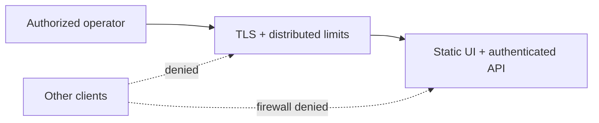

# Self-hosting

Agentic Company OS can run locally or as a single-operator private service. The repository ships fail-closed single-operator authentication, reviewed versioned database migrations, liveness/readiness probes, request limits, and a hardened Docker Compose baseline. It does not ship TLS termination, multi-user authorization, or tenant isolation.

> [!WARNING]
> Public-internet deployment without TLS and the built-in operator token is unsupported. Every authenticated user has full operator-level application authority.

Read [security-model.md](./security-model.md) before choosing a topology.

## Supported operating profiles

| Profile                                 | Status                         | Notes                                                                                                                                |
| --------------------------------------- | ------------------------------ | ------------------------------------------------------------------------------------------------------------------------------------ |
| One operator on one development machine | Supported for alpha evaluation | API, Vite dev, and Vite preview bind to loopback by default. Keep those defaults and a host firewall enabled.                        |
| One operator on a private server/VPN    | Supported alpha profile        | Requires built-in operator auth, TLS, firewall rules, a dedicated OS account, PostgreSQL, and reviewed secret/backups configuration. |
| Shared team or multi-tenant service     | Not supported                  | The built-in token is one operator identity; there is no object-level authorization or tenant isolation.                             |
| Direct public-internet service          | Not supported                  | Do not expose the API or Vite server directly.                                                                                       |

## Prerequisites

- 64-bit host supported by Node.js 24 and the repository's native dependencies
- Node.js 24
- Corepack and the pnpm version pinned in the root `package.json` `packageManager` field
- Chrome, Edge, or compatible Chromium if agent browser features are used
- PostgreSQL for durable state
- a trusted TLS reverse proxy or private TLS ingress for remote access
- a dedicated, unprivileged service account

Process/browser execution should run inside a disposable container or VM if enabled. Do not mount a Docker socket, cloud credentials, a home directory, or other sensitive host paths into that environment.

## 1. Install reproducibly

From a reviewed commit:

```bash
corepack enable
pnpm --version
pnpm install --frozen-lockfile
pnpm test
pnpm run typecheck
pnpm run build
```

Confirm that `pnpm --version` matches the root `packageManager` declaration. Do not replace the lockfile install with npm/Yarn or a non-frozen install on a deployment host.

## 2. Choose storage

### Ephemeral local evaluation

Leave `DATABASE_URL` unset. The API initializes an in-process PGlite database and seeds the default organization. All state is lost when the process stops.

This mode is useful for a demo or UI evaluation only.

### Durable PostgreSQL

Create a dedicated database and least-privilege database user. Supply its connection string as `DATABASE_URL` or an absolute `DATABASE_URL_FILE` secret path.

The API takes a PostgreSQL advisory lock and applies the checked-in Drizzle migration journal before it listens. To validate the chain manually:

```bash
DATABASE_URL='postgresql://...' pnpm --filter @workspace/db run migrate
```

On PowerShell:

```powershell
$env:DATABASE_URL = "postgresql://..."
pnpm --filter @workspace/db run migrate
```

Databases created by an older alpha `drizzle-kit push` have tables but no migration journal. Startup deliberately refuses to guess a baseline. Back up and restore such a database into a staging clone, repair any orphan/invalid rows reported by migration `0008`, then migrate data into a fresh database whose journal was created by `pnpm --filter @workspace/db run migrate`. Do not fabricate journal rows on production.

PostgreSQL TLS, network rules, password rotation, backups, retention, and restore testing are deployment responsibilities.

## 3. Configure a model provider

At least one provider must be available for agent turns.

### OpenRouter

Set `OPENROUTER_API_KEY` in the API process environment. OpenRouter's base URL is pinned in code and is not configurable through the UI.

Optional `APP_PUBLIC_URL` accepts a credential-free HTTP(S) URL and sends only its origin as OpenRouter `HTTP-Referer` attribution. It does not publish the application, change the OpenRouter endpoint, or replace the remote-access security gates.

In split API/worker mode, the Settings UI persists an OpenRouter key as an authenticated encrypted envelope in PostgreSQL and each runtime acknowledges the applied revision. `RUNTIME_CONTROL_KEY` protects that envelope. Combined development keeps the plaintext, gitignored, mode-restricted `data/runtime-config.json` compatibility file. Environment/secret-manager injection is still preferred for a server.

### Direct OpenAI

Set `OPENAI_API_KEY` in the API process environment or a secret manager. The endpoint is code-pinned to `https://api.openai.com/v1`; the browser cannot change the base URL, headers, system prompt, or tool choice sent upstream. The server uses Bearer authentication and writes only provider/model/outcome plus OpenAI's `x-request-id` and a generated `X-Client-Request-Id` to the structured log—never the key, prompt, or response. This follows the [official OpenAI API authentication and request-ID guidance](https://developers.openai.com/api/reference/overview).

Direct model IDs are publically namespaced as `openai:<upstream-id>` so they cannot collide with the legacy Replit fleet. The current first-party GPT-5.6 trio is built in. A server administrator can add reviewed aliases with comma-separated `OPENAI_MODEL_IDS`; this is not a browser setting.

The Settings UI uses the same role-dependent storage as OpenRouter: encrypted PostgreSQL state in split mode, or the plaintext local compatibility file in combined development. Prefer `OPENAI_API_KEY`, `OPENAI_API_KEY_FILE`, or a platform KMS/secret manager on a server.

### Saving credentials and testing a connection

Settings separates a saved application key, an environment key and an absent key. A saved key does not prove upstream access. Removing a saved key requires confirmation and falls back to an environment key if present; it does not necessarily disconnect the provider. In-flight calls may finish with the previous key.

The UI sends the reviewed `expectedRevision` on every key write. Combined mode serializes writes and applies them atomically through one API process; split mode compares the database revision under a row lock. The local file adds a `_revision` field; an existing file without that field starts at revision zero. Legacy API clients may omit the expected revision and do not receive stale-edit protection. Do not run multiple combined-mode writers against the same local file; use split roles and PostgreSQL for coordinated runtimes.

A save response confirms persistence on the server, not that every worker has applied the revision. If persistence or the post-save refresh cannot be confirmed, the UI retains the draft only in page memory and requires a successful refresh and review before resubmitting. Navigation or reload clears key drafts; keys are never written to browser local/session storage by this page.

Connection tests require an explicit catalog model and a separate confirmation. They may incur provider charges. Each test sends a fixed short prompt, requests at most 10 output tokens, uses a 20-second caller deadline and disables SDK retries. The emergency stop is checked before dispatch; it does not promise cancellation of an already-running provider request. A timeout does not prove the provider stopped processing or billing. The response includes model, provider, elapsed milliseconds and the tested revision, with no upstream text. A revision change during the test invalidates its result. Tests are limited to six requests per minute per client/process; key saves to twelve. These are operational safeguards, not a billing cap or a distributed rate limit.

### Local Ollama

Set `OLLAMA_BASE_URL` to an Ollama endpoint such as `http://127.0.0.1:11434/v1`. Docker Compose can reach a host Ollama instance through `http://host.docker.internal:11434/v1`. The endpoint is server-side only and must use HTTP(S), contain no credentials/query/hash, use an empty or `/v1` path, and target exact localhost, `host.docker.internal`, an RFC1918/loopback IPv4 literal, or an IPv6 ULA/loopback literal. Public hosts, link-local/cloud-metadata ranges, redirects, and arbitrary DNS names are rejected.

Catalog discovery reads Ollama's [local model list](https://docs.ollama.com/api/tags) and [model capabilities](https://docs.ollama.com/api-reference/show-model-details). A model is selectable for agent work only when Ollama explicitly reports `tools`; an unknown capability fails closed. Inference uses Ollama's documented [OpenAI-compatible chat endpoint](https://docs.ollama.com/api/openai-compatibility). Local model IDs are namespaced as `ollama:<model>`, and an explicit local pin never leaves Ollama during fallback.

### Replit AI integration

Set both:

- `AI_INTEGRATIONS_OPENAI_API_KEY`
- `AI_INTEGRATIONS_OPENAI_BASE_URL`

The base URL is operator-controlled and receives the configured authorization credential. Only use an endpoint you trust.

Configure provider-side spend limits and alerts. The application has the per-task circuit breakers described below, but no global or provider-account billing cutoff.

## 4. Configure secure defaults

A production private baseline uses one API process and two worker processes.
Start with this API baseline; copy only the database,
runtime-control, model, limit, and isolation values to workers, not the
operator token or public-host settings:

```dotenv
PORT=5000
HOST=127.0.0.1
NODE_ENV=production
LOG_LEVEL=info
OPERATOR_AUTH_TOKEN=<at-least-32-random-characters>
ALLOW_REMOTE_ACCESS=false
TRUSTED_HOSTS=127.0.0.1,localhost
DATABASE_URL=postgresql://...
RUNTIME_CONTROL_KEY=<different-at-least-32-random-characters>
MAX_TASK_STEPS=0
MAX_TASK_TOKENS=100000
MAX_TASK_REPORTED_COST_USD=1
MAX_CONSECUTIVE_TASK_FAILURES=5
MODEL_FALLBACK_MAX_ROUTES=3
MODEL_RETRY_ATTEMPTS_PER_ROUTE=2
MODEL_RETRY_BASE_DELAY_MS=750
ALLOW_AGENT_PROCESS_EXEC=false
ALLOW_AGENT_SUDO=false
ALLOW_FOUNDER_SHELL=false
AGENT_BROWSER_HEADLESS=true
AGENT_BROWSER_ALLOW_PRIVATE_NETWORKS=false
AGENT_BROWSER_ALLOW_WEBSOCKETS=false
MAX_BROWSER_SESSIONS=4
BROWSER_SESSION_IDLE_MS=900000
```

Add the operator token, database URL, runtime-control key, and provider credentials through the process secret mechanism. The packaged start commands support `OPERATOR_AUTH_TOKEN_FILE`, `DATABASE_URL_FILE`, `RUNTIME_CONTROL_KEY_FILE`, `OPENROUTER_API_KEY_FILE`, `OPENAI_API_KEY_FILE`, and `AI_INTEGRATIONS_OPENAI_API_KEY_FILE`; a direct value and its `_FILE` variant cannot both be set. Generate `RUNTIME_CONTROL_KEY` independently from the operator bearer token. It encrypts and authenticates internal browser/provider-control payloads and must never reach the browser. For trusted local use the start commands can load a root `.env`; process variables take precedence. Never commit `.env` or `.secrets`.

Use `CORS_ALLOWED_ORIGINS` only for exact intended browser origins. The public hostname must be in `TRUSTED_HOSTS`. Host/origin checks remain defense in depth around authentication, not replacements for it.

Every PostgreSQL installation, including a combined runtime, now requires `RUNTIME_CONTROL_KEY` for operator request binding and encrypted Terminal output. Back up this key through your secret-management process alongside the database; a missing or changed key makes old output unavailable and does not authorize replay. Ephemeral PGlite development uses a process-local key only when none is configured.

Migration `0025_operator_requests` adds permanent request identities without deleting existing records. Deploy the generated API client/UI and server together: Terminal and Browser mutations require a request UUID and return a receipt/result envelope. Old clients must reload after upgrade; do not translate their requests into new IDs on the server. Exact receipt reads remain available after agent deletion. Browser receipt history never contains screenshots or reusable private leases. Do not purge receipt identities as a retention shortcut.

The API refuses a non-loopback `HOST` unless production mode, operator auth, PostgreSQL, remote opt-in, trusted hosts, and exact CORS origins are configured. An API role forces scheduling off. A worker role forces scheduling on, opens no HTTP listener, needs no operator bearer token, and polls the exact private/HTTPS `RUNTIME_CONTROL_API_URL` using the shared control key. Workers coordinate task, agent, attempt, invocation, and runtime ownership through PostgreSQL. Playwright state remains on its owning worker; the API routes commands to that exact runtime/session/epoch owner through the encrypted channel, so browser-client sticky routing is neither required nor a substitute for owner fencing.

```dotenv
ALLOW_REMOTE_ACCESS=true
NODE_ENV=production
OPERATOR_AUTH_TOKEN=<at-least-32-random-characters>
DATABASE_URL=postgresql://...
TRUSTED_HOSTS=company-os.example.com
CORS_ALLOWED_ORIGINS=https://company-os.example.com
RUNTIME_ROLE=api
SCHEDULER_ENABLED=false
RUNTIME_CONTROL_KEY=<different-at-least-32-random-characters>
AGENT_BROWSER_ALLOW_PRIVATE_NETWORKS=false
AGENT_BROWSER_ALLOW_WEBSOCKETS=false
```

Each worker uses the same `DATABASE_URL` and `RUNTIME_CONTROL_KEY`, plus:

```dotenv
NODE_ENV=production
HOST=127.0.0.1
RUNTIME_ROLE=worker
SCHEDULER_ENABLED=true
RUNTIME_CONTROL_API_URL=https://private-control.example.com/api/internal/runtime-control
ALLOW_REMOTE_ACCESS=false
SERVE_STATIC_UI=false
```

Prefer a same-host proxy with the API still on `127.0.0.1`. Use non-loopback mode only when the authenticated proxy cannot reach loopback, such as a separately isolated proxy workload.

### Circuit-breaker and browser limits

| Variable                               | Baseline | Operational meaning                                                                                  |
| -------------------------------------- | -------- | ---------------------------------------------------------------------------------------------------- |
| `MAX_TASK_STEPS`                       | `0`      | Optional lifetime step cap; `0` keeps finite work alive until an outcome or another circuit breaker. |
| `MAX_TASK_TOKENS`                      | `100000` | Finite-task token circuit breaker; continuous lifetime usage remains ledgered.                       |
| `MAX_TASK_REPORTED_COST_USD`           | `1`      | Finite-task reported-cost breaker; recurring work needs provider/account budgets.                    |
| `MAX_CONSECUTIVE_TASK_FAILURES`        | `5`      | Blocks finite work after repeated runtime bugs; provider/model exhaustion stays queued.              |
| `MODEL_FALLBACK_MAX_ROUTES`            | `3`      | Maximum cost-compatible model routes tried in one logical scheduler step; clamped to 1-4.            |
| `MODEL_RETRY_ATTEMPTS_PER_ROUTE`       | `2`      | Attempts per route for transient timeout/rate-limit/provider errors; clamped to 1-3.                 |
| `MODEL_RETRY_BASE_DELAY_MS`            | `750`    | Exponential in-step retry base; each delay is capped at 5000 ms.                                     |
| `AGENT_BROWSER_ALLOW_PRIVATE_NETWORKS` | `false`  | Dangerous compatibility opt-in for local/private/special destinations; leave false.                  |
| `AGENT_BROWSER_ALLOW_WEBSOCKETS`       | `false`  | WebSockets stay off by default; enabled targets still pass the public-target URL policy.             |
| `MAX_BROWSER_SESSIONS`                 | `4`      | Per-runtime-process live browser-session cap, not a fleet-wide quota.                                |
| `BROWSER_SESSION_IDLE_MS`              | `900000` | Closes idle sessions after 15 minutes; runtime minimum is 60000 ms.                                  |
| `BROWSER_CONTROL_LEASE_MS`             | `30000`  | Exact operator take-over lease TTL; runtime bounds it to 5 seconds-5 minutes.                        |
| `MAX_AGENT_TOOL_ROUNDS`                | adaptive | Optional hard override for model tool rounds; clamped to 4-16.                                       |

Task limits are evaluated between scheduler steps and may overshoot within a multi-round step. Keep provider-side spend limits and alerts. Browser URL/DNS checks are application-layer defense in depth, not a replacement for firewall or outbound-proxy policy.

## 5. Build and run

The root build creates both the API bundle and static UI output:

```bash
pnpm run build
```

Start the built HTTP API with its protected environment (production requires
PostgreSQL, an operator token, and a runtime-control key):

```bash
PORT=5000 HOST=127.0.0.1 NODE_ENV=production \
RUNTIME_ROLE=api SCHEDULER_ENABLED=false \
DATABASE_URL='postgresql://...' OPERATOR_AUTH_TOKEN='...' \
RUNTIME_CONTROL_KEY='independently-generated-32-plus-character-secret' \
pnpm --filter @workspace/api-server run start
```

In two other supervised processes, start two workers with the same database
and control key. They deliberately receive no operator token and expose no
HTTP listener:

```bash
NODE_ENV=production RUNTIME_ROLE=worker SCHEDULER_ENABLED=true \
DATABASE_URL='postgresql://...' \
RUNTIME_CONTROL_KEY='independently-generated-32-plus-character-secret' \
RUNTIME_CONTROL_API_URL='http://127.0.0.1:5000/api/internal/runtime-control' \
pnpm --filter @workspace/api-server run start:worker
```

Run that worker command twice under a process manager. Use HTTPS or private
HTTP for `RUNTIME_CONTROL_API_URL`; the path must be exactly
`/api/internal/runtime-control`.

PowerShell:

```powershell
$env:PORT = "5000"
$env:HOST = "127.0.0.1"
$env:NODE_ENV = "production"
$env:RUNTIME_ROLE = "api"
$env:SCHEDULER_ENABLED = "false"
$env:DATABASE_URL = "postgresql://..."
$env:OPERATOR_AUTH_TOKEN = "..."
$env:RUNTIME_CONTROL_KEY = "independently-generated-32-plus-character-secret"
pnpm --filter @workspace/api-server run start
```

In each of two additional PowerShell/process-manager sessions:

```powershell
$env:NODE_ENV = "production"
$env:RUNTIME_ROLE = "worker"
$env:SCHEDULER_ENABLED = "true"
$env:DATABASE_URL = "postgresql://..."
$env:RUNTIME_CONTROL_KEY = "independently-generated-32-plus-character-secret"
$env:RUNTIME_CONTROL_API_URL = "http://127.0.0.1:5000/api/internal/runtime-control"
Remove-Item Env:OPERATOR_AUTH_TOKEN -ErrorAction SilentlyContinue
pnpm --filter @workspace/api-server run start:worker
```

The static frontend is written to:

```text
artifacts/agentic-company-os/dist/public
```

Set `SERVE_STATIC_UI=true` and `STATIC_UI_DIR` to that absolute directory to serve the UI and API on one origin, or use a maintained reverse proxy/static server.

### Docker Compose baseline

The root `Dockerfile` builds the UI/API and worker entrypoints, deploys only the API production dependency graph into the ordinary runtime stage, runs as a non-root user, installs Chromium, and exposes `/api/readyz` on the API image. `compose.yaml` starts one HTTP-only API and two scheduler-only workers on one PostgreSQL control plane. The API alone binds a loopback host port; workers open no listener and poll the API's private runtime-control endpoint. All runtime containers use read-only application files, drop Linux capabilities, provision Chromium shared memory, and share the persistent data/workspace volumes. They apply the bundled [Chromium seccomp profile](../deploy/README.md) to permit its user-namespace sandbox. Hosts must permit unprivileged user namespaces; a host policy that denies them prevents browser startup. Keep the sandbox enabled.

Create `.secrets/` with mode `0700` and four one-line files with mode `0600`:

- `operator_auth_token`: at least 32 cryptographically random characters;
- `runtime_control_key`: a separate, independently generated secret of at least 32 characters;
- `postgres_password`: the dedicated database password; and
- `database_url`: `postgresql://agentic:<URL-encoded-password>@db:5432/agentic_os`.

Then run:

```bash
docker compose up --build -d
docker compose ps
curl --fail http://127.0.0.1:5000/api/readyz
```

`docker compose ps` should show `app`, `worker-1`, `worker-2`, and `db` running.
Workers have their Docker HTTP healthcheck disabled by design because they do
not listen; verify their durable heartbeats and effective state in the
authenticated Operations view/API. Keep the control endpoint inside the
private Compose network and rotate its key with a coordinated API/worker
restart.

Do not use `vite dev` or `vite preview` as the public frontend. They bind to loopback by default and are intended for development only; do not override `DEV_HOST` or `PREVIEW_HOST` to publish them.

For phone access through a private HTTPS URL, follow [Phone access without a separate app](./mobile-access.md). The default Compose host port stays on loopback; a private tunnel or VPN forwards to that port while the operator login remains required.

## 6. Keep one TLS boundary in front

The intended private-server shape is:



The built-in API accepts `Authorization: Bearer <OPERATOR_AUTH_TOKEN>` or a signed HttpOnly, `SameSite=Strict`, production-`Secure` session created by `POST /api/auth/login`. `/api/healthz`, `/api/readyz`, and `/api/auth/*` are intentionally public; every other API route is guarded.

The edge must:

1. terminate TLS and never downgrade authenticated traffic;
2. preserve secure session/cookie settings;
3. apply distributed request/rate/concurrency limits in addition to the bounded per-process limiter;
4. preserve correct host/proto information and list the public hostname in `TRUSTED_HOSTS`;
5. avoid caching API or settings responses;
6. preserve or strengthen the application's restrictive security headers;
7. prevent direct network access to the API port; and
8. log access without recording credentials or sensitive request bodies.

The built-in token does not add per-agent, per-object, or multi-user authorization. Treat its holder as a full operator and keep the audience to one trusted operator.

## 7. Isolate powerful runtimes

Keep all execution flags false unless the whole runtime is already isolated.

### Agent process execution

`ALLOW_AGENT_PROCESS_EXEC=true` lets permitted agents spawn allowlisted host binaries such as interpreters and package tools. While the tracked root remains addressable, timeout, cancellation, and emergency stop target its Windows process tree or dedicated POSIX process group (TERM, then KILL), with real-descendant regression coverage. If the root first exits naturally after orphaning a child—especially on Windows without a Job Object—the child can escape application tracking. Deliberate detach and PID-namespace escapes likewise require cgroup/PID containment in a dedicated container or VM.

If enabled, use:

- a disposable container/VM;
- a non-root user;
- read-only base filesystem plus a dedicated workspace volume;
- CPU, memory, PID, disk, and time limits;
- no host/home/cloud credential mounts;
- no container runtime socket;
- restricted DNS and outbound network; and
- teardown/rebuild between trust domains.

### Founder shell

`ALLOW_FOUNDER_SHELL=true` enables a platform shell with the API process environment and OS-account authority. Prefer leaving it disabled and using a separate audited administrative path outside the application.

### CEO sudo

`ALLOW_AGENT_SUDO=true` opens a distinct autonomous host-shell path only for the server-managed canonical root CEO when its `canUseSudo` permission is also true. Startup refuses this flag on a non-loopback or remote-enabled API. Every command must match a five-minute human-approved task, agent, tool, exact command hash, typed digest confirmation, and the API-process/host/physical-workspace target that created the approval; it is consumed once. A restart or replica mismatch safe-drops the action. The public VM terminal route cannot invoke this authority.

The shell receives a minimal allowlisted environment and the agent workspace as its initial home/working directory, but it still has the existing API service account's filesystem and process authority. It does not perform Windows UAC or Unix privilege elevation. Approval fixes the shell string, not mutable referenced scripts, package hooks, executables, or network responses. Timeout/emergency stop applies the process-tree cleanup above, but detached or namespace-escaped processes remain possible without container/VM containment. Pending approvals temporarily persist the full command so the operator can inspect it; consumed sudo payload/preview data is reduced to digest metadata.

Enable CEO sudo only inside a disposable, dedicated VM or container with no personal home directory, cloud credentials, wallet material, SSH keys, container-runtime socket, or unrelated repositories mounted. Run the API under the least-privileged OS account that can perform the intended work. Do not enable it on a general-purpose workstation or remotely exposed control plane.

### Browser runtime

Agent browser requests are public-web filtered by default: the runtime allows only HTTP(S), rejects URL credentials, and blocks local/private/special targets for both top-level and subresource requests. Chromium is forced through a loopback resolving proxy that validates every DNS answer and connects to the selected public IP; QUIC and non-proxied WebRTC are disabled. Keep `AGENT_BROWSER_ALLOW_PRIVATE_NETWORKS=false`; setting it to `true` is a dangerous compatibility opt-in that bypasses this public-target restriction.

Operator take-over is a real lease, not a visual toggle. Only the take-over response returns the lease ID; view/status responses mask it. Keep the lease in per-tab memory, heartbeat it while controlling the browser, include it in navigation/input/close calls, and release it on hand-back. Concurrent operator input is bounded and FIFO. A stale or missing lease is rejected before a browser session can be created.

The resolving proxy closes the ordinary DNS-check/DNS-use gap, but it is not a destination allowlist or OS network sandbox. Public-web actions can still have real effects, and lower-layer proxy/routing defects or browser vulnerabilities require defense in depth. Run the browser/runtime in a network segment that cannot reach cloud metadata, internal admin surfaces, or unnecessary private services; restrict outbound destinations at a network-enforced firewall/gateway; and do not sign high-value accounts into agent browser contexts.

Playwright sessions, server-only snapshot nonces, exact `ElementHandle` objects,
and element-ref registries live only in the memory of the worker that opened
them. PostgreSQL records the exact runtime incarnation, session ID, and epoch.
The API resolves that owner and sends commands only through its authenticated,
encrypted runtime-control channel; the worker long-polls outbound, so no worker
HTTP port or browser-client sticky routing is needed. The owner reuses the
captured handle, verifies that it remains connected, and compares its live
page/element binding with the approved binding. It never trusts a page-owned
DOM marker or silently searches for a similar element.

A dead/restarted owner, stale handle, changed target, delivery timeout, or
ambiguous post-dispatch acknowledgement is not retried on another worker. An
action that is known not to have crossed the effect boundary can safe-drop; an
at-most-once action whose external result cannot be known becomes a durable
`unknown` receipt and blocks automatic continuation. In Operations, reconcile
only after independently establishing `confirmed_applied` or
`confirmed_not_applied` and recording the audit note. Reconciliation never
replays the old receipt. A later approval-bound attempt needs a new logical
receipt and, where applicable, a fresh snapshot and approval.

## 8. Health and verification

The Expert profile's Conversation tab uses the [durable expert request API](./agent-requests.md) for questions, assigned work and recurring responsibilities. Migration `0021` stores persistent receipts in the same database; include them in backups. A tab saves its exact pending identity before sending and uses read-only recovery after an interrupted response. Tab storage is not shared across devices and closing the tab may remove it. Project-scoped chat and other legacy clients do not gain send deduplication until migrated. An unconfirmed receipt is never automatically re-executed, and a completed send does not establish completion of its underlying project or external tools.

The Computer editor now requires a [reviewed file version](./workspace-files.md) for updates and missing-only creation for new files. Preview content is never accepted as a complete editable source. Cooperating production API and worker processes need the same PostgreSQL database and workspace filesystem for the file-operation lock; the database cannot roll back a filesystem effect after connection loss. Older alpha clients must send `expectedVersion` with file writes.

Basic API health:

```bash
curl --fail http://127.0.0.1:5000/api/healthz
```

Expected response:

```json
{ "status": "ok" }
```

This liveness endpoint confirms only that the HTTP process responds. Use readiness for traffic and rollout decisions:

```bash
curl --fail http://127.0.0.1:5000/api/readyz
```

Readiness returns `200` only after database connectivity, migration, seed/recovery, and scheduler initialization complete. It returns `503` during startup, database failure, and graceful shutdown. Provider/browser availability is not part of readiness.

The server writes structured Pino logs to stdout/stderr in production. Request logging omits query strings and known error/command/credential fields are redacted, but model- or page-produced metadata is still untrusted and may be sensitive. The repository does not expose Prometheus metrics, distributed tracing, or an immutable audit sink; collect logs and host/container/database metrics in your operations stack, alert on repeated auth failures, readiness failures, emergency-stop changes, provider errors, and capacity limits, and apply access controls plus retention outside the process.

Before accepting real work, verify:

- the external URL requires authentication;
- the raw API port is unreachable from another host;
- unauthenticated `/api/healthz` and `/api/readyz` remain minimal and public, while `/api/settings/llm` returns `401`;
- a valid bearer token reaches a protected route, an invalid token does not, and the login cookie is `HttpOnly`, `SameSite=Strict`, and `Secure` in production;
- an unknown `Host` header returns `421` and the expected edge hostname is accepted;
- a cross-site state-changing request returns `403`;
- restarts preserve state when PostgreSQL is configured;
- provider tests use an expected model and account;
- all three execution flags report disabled behavior, or CEO host shell is intentionally tested only on loopback in a disposable runtime;
- the runtime registry reports exactly the intended one API and two healthy workers, and an intentionally killed worker becomes stale before a new incarnation rejoins;
- the API and workers all use the same durable PostgreSQL database and runtime-control key, while workers receive no operator bearer and expose no HTTP listener;
- concurrent claims resolve to one live lease owner, stale task/agent/attempt/invocation owners cannot commit, and receipt reservation races converge;
- browser work remains on its recorded runtime/session/epoch owner; restarting that worker never retargets or replays the effect elsewhere, and ambiguous outcomes surface as `unknown` for guarded reconciliation;
- transactional/idempotent/at-most-once receipt recovery is exercised and no test is described as universal exactly-once delivery;
- task step/token/reported-cost and consecutive-failure limits block work at the intended thresholds, with provider-side budgets still active;
- each intended CORS origin works and an unlisted origin does not receive CORS access;
- browser egress cannot reach forbidden private/metadata targets, WebSockets remain off unless explicitly required, and idle/session limits reclaim capacity;
- an emergency stop accepted by one replica becomes effective on scheduler-disabled replicas within `EMERGENCY_STOP_MONITOR_MS`, and failed local cleanup is retried; and
- logs and runtime-control metadata contain no keys, plaintext browser input, or confidential prompt content.

For a commit-specific fault/recovery proof, run the Docker or native Windows
PostgreSQL endurance harness in [endurance.md](./endurance.md). A short smoke is
only smoke evidence and must remain `verified24h: false`; it does not satisfy a
24-hour release claim.

## Data, files, and backups

| Data                  | Default location                                                                                                               | Backup guidance                                                                                                                                                                       |
| --------------------- | ------------------------------------------------------------------------------------------------------------------------------ | ------------------------------------------------------------------------------------------------------------------------------------------------------------------------------------- |
| Domain state          | PostgreSQL or in-process PGlite                                                                                                | Back up PostgreSQL; PGlite fallback is not recoverable after exit.                                                                                                                    |
| Runtime provider keys | Split roles: encrypted `provider_runtime_config` row in PostgreSQL; combined development: plaintext `data/runtime-config.json` | A split-role restore also needs the matching protected `RUNTIME_CONTROL_KEY`; for combined mode prefer restoring keys from a secret manager instead of backing up the plaintext file. |
| Model usage ledger    | `usage_events` in the selected database                                                                                        | Reconcile provider-reported tokens/cost with provider billing; do not treat it as an immutable financial ledger.                                                                      |
| Agent workspaces      | `agent-sandboxes/agent-{id}`                                                                                                   | Treat as untrusted/sensitive; encrypt, restrict, scan, and apply retention.                                                                                                           |
| Built artifacts       | package-specific `dist/`                                                                                                       | Rebuild from source; do not treat as primary data.                                                                                                                                    |
| Logs                  | process-manager destination                                                                                                    | Redact, access-control, rotate, and expire.                                                                                                                                           |

The `data/` and `agent-sandboxes/` directories are gitignored, not encrypted. Gitignore is not a data-protection control.

For the Compose profile, take a logical backup without stopping the application:

```bash
docker compose exec -T db pg_dump -U agentic -d agentic_os -Fc > agentic-os.dump
```

Restore into a new empty database/container first, run the target application migrations against that copy, and execute a real read/write smoke test before calling the backup verified. Encrypt backup files, keep them outside the host/container failure domain, apply retention, and record restore-test dates. A database dump does not include `agent-data` or `agent-sandboxes`; back those volumes separately if policy requires them.

## Upgrades

1. Read release notes and security changes.
2. Stop task creation and wait for/record active work.
3. Back up PostgreSQL and verify the backup.
4. Save non-secret configuration and note currently pinned provider/models.
5. Check out the reviewed target commit.
6. Run `corepack enable` and confirm the pinned pnpm version.
7. Run `pnpm install --frozen-lockfile`, `pnpm test`, `pnpm run typecheck`, and `pnpm run build`.
8. Run `pnpm --filter @workspace/db run migrate` against a restored staging copy. Review and repair any migration preflight failure; never bypass it on production.
9. Start the HTTP-only API first. Startup holds the migration advisory lock, applies the checked-in chain, and becomes ready only afterward. Then roll out the scheduler-only workers with the same database and runtime-control key.
10. Confirm the intended runtime topology in Operations, then repeat health, auth-boundary, persistence, exact-owner browser, receipt recovery/reconciliation, and provider smoke checks.

Have a rollback plan that restores both the previous application commit and a database version compatible with it. Code rollback alone may not reverse a schema change.

## Troubleshooting

### Expert configuration changed or saving is unconfirmed

The detail screen sends the `configVersion` it reviewed as `expectedConfig` when saving instructions, model selection, permissions, activation or a portrait. The server compares inside the agent row lock and rejects stale edits with `409 AGENT_CONFIG_CHANGED`. The version is an opaque hash of editable configuration, not a monotonic revision or an audit trail: restoring identical configuration restores the same hash. Worker heartbeats and progress do not invalidate it. Legacy API callers may omit the precondition; external clients should send it to avoid overwriting changes. Avatar reset sends the precondition as a query parameter.

After a conflict or unknown response, refresh and compare with the server before saving again. A timeout does not prove rollback. Draft instructions and prepared portraits stay only in the current page, including across its tabs; leaving or reloading clears them. Restoring an archived expert checks `MAX_ACTIVE_AGENTS`, returns it to idle and does not resume its previously blocked tasks. Model changes apply at the next model selection and do not switch an already-running provider request. A manual choice in the UI requires an available tool-capable catalog entry; API clients can still supply custom model IDs, and neither path guarantees later provider access.

### API exits with `Invalid PORT value`

The API defaults to port `5000`. Remove the invalid override or set `PORT` to an integer from 1 through 65535.

### API refuses non-loopback exposure

This is the secure default. Keep the API on `127.0.0.1` when possible. Non-loopback binding additionally requires `NODE_ENV=production`, a 32+ character `OPERATOR_AUTH_TOKEN`, durable `DATABASE_URL`, `ALLOW_REMOTE_ACCESS=true`, and exact non-empty `TRUSTED_HOSTS`/`CORS_ALLOWED_ORIGINS`.

### Reverse-proxied requests return `421`

Add the public request hostname (hostname only, comma-separated) to `TRUSTED_HOSTS` and confirm the proxy forwards the intended `Host` header. Do not trust arbitrary hosts.

### UI loads but API calls fail

For non-Replit local development, the UI defaults `LOCAL_API_TARGET` to `http://127.0.0.1:5000`; override it only if the API uses another local address. For a static deployment, verify that the reverse proxy forwards `/api/*` to the API without removing `/api`.

### State disappears after restart

`DATABASE_URL` was absent in a development run, so the service used in-memory PGlite. Production refuses to start this way. Provision PostgreSQL; startup applies the migration chain automatically.

### OpenRouter models are unavailable

Verify the key is present in the API process or trusted runtime settings. The provider catalog refresh is cached and may preserve the previous list briefly after a remote failure.

### Direct OpenAI models are unavailable

Verify `OPENAI_API_KEY` (or trusted runtime settings) and the account's access to the selected upstream model. Public IDs include the `openai:` namespace, but the namespace is stripped before the fixed OpenAI request. Correlate a failed request with the redacted server log's request ID; do not paste credentials into logs or support messages.

### Ollama is configured but no model is selectable

Verify the endpoint is local/private and reachable from the API process (from Compose, `host.docker.internal` is usually the host). Pull a model that reports tool support. Models discovered without a `tools` capability remain visible but disabled by design.

### Agent commands say process execution is disabled

That is the secure default. Built-in workspace file commands still work. Do not enable process execution merely to remove the warning; isolate the entire runtime first.

### Founder terminal is forbidden

That is the secure default. Use normal host administration outside the application. Enabling founder shell should be an explicit, temporary risk decision inside an isolated environment.

## Final go/no-go

Do not place the instance on a remote network unless all of these are true:

- authentication and TLS protect UI and API;
- the API has no bypass path;
- remote-access, trusted-host, origin, and runtime-role settings match the intended one-API/two-worker topology;
- the API and every worker share the same healthy PostgreSQL database, with PGlite limited to one-process development evaluation;
- the API and workers share a separate high-entropy runtime-control key, workers expose no HTTP port, and the internal control endpoint is not public;
- agent browser work has verified exact runtime/session/epoch ownership, with no alternate-worker replay after owner loss;
- `unknown` external outcomes require independently verified, audited reconciliation and are never treated as an exactly-once guarantee;
- task circuit breakers and provider-side hard budgets are configured;
- only trusted full operators can authenticate;
- the host/runtime is isolated and low-privilege;
- process/founder execution remains disabled or is separately contained;
- browser egress is restricted, WebSockets/private-network access remain off unless explicitly contained, and session limits are bounded;
- provider budgets and secrets are controlled;
- PostgreSQL backups and restore tests exist; and
- the limitations in [security-model.md](./security-model.md) are accepted.

If any item is unknown, keep the instance local.
